# C4M APP · Especificación de diseño de alta fidelidad

**Versión 1 · 5 de octubre de 2026 · Álvaro Romero (Creators for Media)**

Este documento convierte la auditoría UI/UX (`auditoria-ui-ux-c4m.md`) en un sistema y unas pantallas concretas para que un agente de código monte un **prototipo funcional**. Cubre la Fase 2 de la auditoría (P2.1–P2.6: AppShell y ⌘K, PageShell/PageHeader, contrato rediseñado, DataTable, alta unificada, Centro de acciones) y el diseño visual del panel de IA de la Fase 3 (P3.2: ⌘J y tarjetas de aprobación).

**Punto de partida.** Doy por hecho que existe lo de la Fase 0 + Fase 1 (P0.1–P1.6): tokens semánticos, `StatusPill`, `Field`, correcciones de axe, copy, layout público y el arreglo del chunk de zod. Lo está implementando otro agente en la rama `ux/fase-0-1`. **A 5 oct 2026, 03:30 (Madrid), esa rama aún no está publicada en GitHub: `github.com/Frekit/C4M` solo tiene `main` (`453c065`).** Tampoco hay despliegue en Vercel enlazado al repo. Las maquetas son HTML/CSS estático hecho para este documento, no capturas de la app.

**Regla de este documento.** Todo estado, campo o dato de las pantallas sale del modelo real (`prisma/schema.prisma`, `src/lib/domain/*`, formulario de `/firmar`). Cuando propongo algo que hoy no existe, lo marco con **[nuevo]** y digo qué hace falta en backend.

## Índice de entregables

| Archivo | Qué es |
|---|---|
| `design-spec-c4m.md` / `.pdf` | Este documento |
| `mockups/tokens.css` | Variables CSS claro/oscuro, generadas por `tools/tokens.mjs` |
| `tokens-contrast.json`, `tokens-hex.json` | Los 76 pares de contraste medidos (38 por modo) y los hex de cada token |
| `mockups/base.css`, `mockups/*.html` | Maquetas HTML/CSS con los tokens de la spec |
| `mockups/*.png` | Capturas con Chrome headless (puppeteer-core) a 1440, 1024 y 375 px |
| `mockups/fonts/` | Geist, Geist Mono y Newsreader (woff2, licencia OFL) |
| `tools/shoot-mock.mjs`, `tools/shoot-all.sh` | Script de capturas (`bash tools/shoot-all.sh`) |

---

## 1. Principios de diseño

C4M es una agencia que mueve dinero entre marcas (que pagan en US$) y creators (que cobran en su moneda) a cambio de contenidos con fecha. Cada contrato tiene tres riesgos: que no se firme, que el contenido no salga a tiempo y que el dinero no cuadre. Los principios salen de ahí.

### 1.1 Una pantalla, una decisión, un botón
Cada vista tiene **un solo CTA primario** (fondo `--primary`), que cambia según el estado del objeto. Todo lo demás es secundario, ghost o va en el menú ⋯.
*Por qué:* en la auditoría, el CTA del contrato `CTR-2026-001` estaba a 5.925 px de alto (13.433 px en móvil), rodeado de 137 inputs. Si la acción siguiente no se ve, el contrato se queda parado.
*Cómo se aplica:* barra de acción fija (sticky) en Contrato, `PageHeader` con un único hueco para el primario y Centro de acciones con un botón por fila.

### 1.2 El dinero se lee de un vistazo y nunca confunde
Todas las cifras usan `tabular-nums`, van alineadas a la derecha y llevan su moneda. La venta va en **US$** y el coste en **la moneda del creator**. El tipo de cambio aparece fijado y el margen se ve siempre al lado. El formato es `es-ES` (`1.350,00 €`, `US$ 1.350,00`), y las fechas van en `Europe/Madrid` (P0.3).
*Por qué:* el modelo guarda `salePriceCentsPerContent` (US$), `costMinorPerContent` + `costCurrency` y `fxUnitsPerUsd` fijado al crear el contrato. Si se mezclan monedas sin etiqueta o se ocultan márgenes, se toman malas decisiones comerciales.

### 1.3 Lo urgente te encuentra a ti
La home deja de ser un tablero de cifras y pasa a ser una **cola de decisiones** ordenada por gravedad. Cada aviso trae 1–3 salidas concretas. El color comunica *de quién es el turno*:
- `warning` = te toca a ti
- `info` = esperando a otro
- `danger` = bloqueado o vencido
- `success` = hecho
- `neutral` = sin empezar o cerrado

*Por qué:* los avisos ya existen en el dominio (`ops-alerts.ts`: `expired_signature`, `unsigned_published`). Hoy están enterrados en tablas. Passionfroot resuelve lo mismo con «Action needed» y opciones A/B/C (ver §6).

### 1.4 La IA propone, tú decides (y queda escrito)
El asistente nunca escribe sin pasar por ti. Cada cambio llega como una **fila aprobable** (aceptar / descartar), agrupada bajo el objeto que toca. Lo propuesto por IA lleva siempre el tono violeta `--ai`, que no se usa para nada más. Cada ejecución deja un `AuditEvent` «C4M IA en nombre de <email>» (P3.1).
*Por qué:* se trata de contratos y pagos, así que un error cuesta dinero y confianza. Es el patrón de Attio Ask («Intelligent suggestions. Human decisions.») y encaja con `toolApproval: 'user-approval'` del AI SDK.

### 1.5 Fuera de casa, otro tono
Las pantallas públicas (`/firmar`, `/hablar`, `/invitacion`) son para creators y marcas, no para el equipo:
- Tono más cálido, con titular serif.
- Sin jerga interna.
- Una sola tarea por pantalla y el importe que recibe la persona siempre visible.

*Por qué:* la auditoría encontró que `/hablar` mostraba al cliente mensajes internos del asistente. Lo de dentro y lo de fuera tienen que verse y ser distintos (P0.2, P1.5).

---

## 2. Sistema de diseño

### 2.1 Color

**Base cálida, acento terracota y violeta solo para la IA.**
- Los neutros tiran a cálido (hue 60–85, croma 0,002–0,02): papel, no gris de oficina. Es la misma idea que el fondo de Passionfroot, que medí en `oklch(0.993 0.004 96)`.
- El CTA primario es casi negro cálido (`--primary`), no el color de marca. Así el terracota (`--brand`, `--brand-ui`) queda para identidad, foco, selección y barras de progreso.
- `--ai` (violeta, hue 285) se reserva **solo** a contenido propuesto o generado por IA.

Todos los valores están en OKLCH y se definen en `tools/tokens.mjs`, que genera `mockups/tokens.css` (`:root` y `.dark`). La columna Hex es el equivalente sRGB, para herramientas que no leen OKLCH.

| Token | Claro (OKLCH) | Hex | Oscuro (OKLCH) | Hex |
|---|---|---|---|---|
| `--bg` | `oklch(0.985 0.004 80)` | `#fbfaf7` | `oklch(0.165 0.008 60)` | `#110e0b` |
| `--surface` | `oklch(0.997 0.002 85)` | `#fffefd` | `oklch(0.2 0.009 60)` | `#191512` |
| `--surface-2` | `oklch(0.968 0.006 80)` | `#f7f4f0` | `oklch(0.225 0.01 60)` | `#1f1b17` |
| `--surface-3` | `oklch(0.945 0.008 78)` | `#f0ece7` | `oklch(0.26 0.011 60)` | `#28231f` |
| `--fg` | `oklch(0.22 0.012 60)` | `#1f1915` | `oklch(0.95 0.006 80)` | `#f1eeea` |
| `--fg-muted` | `oklch(0.47 0.02 60)` | `#645850` | `oklch(0.74 0.014 70)` | `#b1a9a2` |
| `--fg-subtle` | `oklch(0.53 0.016 60)` | `#736a63` | `oklch(0.68 0.014 70)` | `#9e978f` |
| `--border` | `oklch(0.91 0.009 75)` | `#e5e0db` | `oklch(0.29 0.01 60)` | `#2f2a26` |
| `--border-strong` | `oklch(0.64 0.012 70)` | `#918b84` | `oklch(0.52 0.012 65)` | `#6e6862` |
| `--primary` | `oklch(0.27 0.02 50)` | `#2f241e` | `oklch(0.93 0.012 80)` | `#ece7df` |
| `--primary-hover` | `oklch(0.34 0.022 50)` | `#42352e` | `oklch(0.86 0.014 80)` | `#d6d0c7` |
| `--primary-fg` | `oklch(0.985 0.004 80)` | `#fbfaf7` | `oklch(0.2 0.012 60)` | `#1a1511` |
| `--brand` | `oklch(0.54 0.15 45)` | `#b24b0a` | `oklch(0.76 0.13 52)` | `#f2985f` |
| `--brand-ui` | `oklch(0.64 0.155 45)` | `#d6682f` | `oklch(0.72 0.14 50)` | `#e9884d` |
| `--brand-muted` | `oklch(0.96 0.025 55)` | `#ffeee2` | `oklch(0.27 0.045 50)` | `#381f11` |
| `--brand-fg` | `oklch(0.99 0.004 80)` | `#fdfbf9` | `oklch(0.18 0.01 60)` | `#15110d` |
| `--success` | `oklch(0.50 0.12 150)` | `#21763c` | `oklch(0.80 0.12 150)` | `#83d494` |
| `--success-muted` | `oklch(0.955 0.035 150)` | `#e0f7e4` | `oklch(0.26 0.04 150)` | `#15291a` |
| `--success-dot` | `oklch(0.62 0.15 150)` | `#2e9e52` | `oklch(0.72 0.15 150)` | `#53be70` |
| `--warning` | `oklch(0.52 0.115 62)` | `#97570d` | `oklch(0.84 0.12 80)` | `#f4c26a` |
| `--warning-muted` | `oklch(0.962 0.045 85)` | `#fff1d1` | `oklch(0.27 0.045 75)` | `#33230a` |
| `--warning-dot` | `oklch(0.66 0.14 68)` | `#c97f14` | `oklch(0.8 0.15 75)` | `#f5ae39` |
| `--info` | `oklch(0.50 0.10 245)` | `#296898` | `oklch(0.80 0.09 245)` | `#8cc4f4` |
| `--info-muted` | `oklch(0.955 0.025 245)` | `#e3f2ff` | `oklch(0.26 0.04 245)` | `#122636` |
| `--info-dot` | `oklch(0.62 0.13 245)` | `#348dcf` | `oklch(0.7 0.12 245)` | `#58a5e4` |
| `--danger` | `oklch(0.50 0.19 27)` | `#b7191c` | `oklch(0.78 0.13 25)` | `#ff958d` |
| `--danger-muted` | `oklch(0.955 0.03 25)` | `#ffe9e6` | `oklch(0.27 0.05 25)` | `#3b1c1a` |
| `--danger-dot` | `oklch(0.60 0.21 27)` | `#e23532` | `oklch(0.68 0.19 27)` | `#f75e54` |
| `--focus` | `oklch(0.64 0.155 45)` | `#d6682f` | `oklch(0.72 0.14 50)` | `#e9884d` |
| `--ai` | `oklch(0.52 0.17 285)` | `#6353c5` | `oklch(0.78 0.12 285)` | `#afacff` |
| `--ai-muted` | `oklch(0.96 0.022 285)` | `#f0f0ff` | `oklch(0.27 0.045 285)` | `#24233c` |

**Cómo usar cada rol**
| Rol | Para qué | Nunca |
|---|---|---|
| `bg` / `surface` / `surface-2` / `surface-3` | Lienzo; tarjetas y popovers; sidebar, cabeceras de tabla y hover; segmentados, hover de items y skeleton | Sombras en modo oscuro: ahí la elevación es una superficie más clara |
| `fg` / `fg-muted` / `fg-subtle` | Texto principal; secundario (metadatos); terciario (placeholder, pistas, contadores) | `fg-subtle` en texto de más de una línea |
| `border` / `border-strong` | Separadores y contornos de tarjetas; contorno de inputs y botones secundarios (≥ 3:1, WCAG 1.4.11) | `border` como contorno de input: no llega a 3:1 |
| `primary` / `primary-hover` / `primary-fg` | El CTA primario, toasts y la barra de acciones en lote | Más de un primario por vista |
| `brand` / `brand-ui` / `brand-muted` | Texto de marca y enlaces de marca; barras de progreso, indicador de selección y logo; fondo de fila seleccionada | Fondos grandes |
| `success` · `warning` · `info` · `danger` (+ `-muted`, `-dot`) | Texto de la pill sobre `-muted`; el punto de 6 px usa `-dot` | Color sin texto |
| `focus` | Anillo de foco de 2 px con 2 px de separación; en inputs, 3 px de halo al 22 % | Quitar el foco sin poner otro |
| `ai` / `ai-muted` | Pill «Propuesto por IA», tarjeta de aprobación, filas tocadas por la IA, chips | Cualquier cosa no generada por IA |

**Contraste comprobado con script.** `node tools/tokens.mjs check v` calcula el ratio WCAG 2.x de cada par con culori. Resultado: **76 pares, 0 fallos**. Mínimo exigido: 4,5 para texto y 3,0 para bordes, foco, puntos e iconos.

| Par (texto / fondo) | Uso | Mín. | Claro | Oscuro |
|---|---|---:|---:|---:|
| `fg` / `bg` | Texto principal | 4,5 | 16,61 | 16,66 |
| `fg` / `surface` | Texto en tarjeta | 4,5 | 17,19 | 15,66 |
| `fg` / `surface-2` | Texto en sidebar/cabecera tabla | 4,5 | 15,80 | 14,80 |
| `fg` / `surface-3` | Texto en fila hover/seleccionada | 4,5 | 14,76 | 13,45 |
| `fg-muted` / `bg` | Texto secundario | 4,5 | 6,57 | 8,35 |
| `fg-muted` / `surface` | Secundario en tarjeta | 4,5 | 6,80 | 7,84 |
| `fg-muted` / `surface-2` | Secundario en sidebar | 4,5 | 6,25 | 7,41 |
| `fg-muted` / `surface-3` | Secundario en hover | 4,5 | 5,84 | 6,74 |
| `fg-subtle` / `surface` | Placeholder / metadato | 4,5 | 5,25 | 6,28 |
| `fg-subtle` / `surface-2` | Placeholder en tabla | 4,5 | 4,83 | 5,93 |
| `border-strong` / `surface` | Borde de input (1.4.11) | 3 | 3,34 | 3,28 |
| `border-strong` / `bg` | Borde de input sobre fondo | 3 | 3,23 | 3,49 |
| `primary-fg` / `primary` | Botón primario | 4,5 | 14,50 | 14,75 |
| `primary-fg` / `primary-hover` | Botón primario hover | 4,5 | 11,33 | 11,84 |
| `primary` / `bg` | Botón primario vs fondo (no-texto) | 3 | 14,50 | 15,68 |
| `brand` / `surface` | Enlace / texto marca | 4,5 | 5,34 | 8,13 |
| `brand` / `bg` | Enlace sobre fondo | 4,5 | 5,16 | 8,65 |
| `brand-ui` / `surface` | Indicador marca (no-texto) | 3 | 3,54 | 6,99 |
| `brand` / `brand-muted` | Texto marca sobre tinte | 4,5 | 4,77 | 6,84 |
| `focus` / `bg` | Anillo de foco vs fondo | 3 | 3,42 | 7,43 |
| `focus` / `surface` | Anillo de foco vs tarjeta | 3 | 3,54 | 6,99 |
| `success` / `success-muted` | Pill éxito | 4,5 | 5,04 | 8,59 |
| `warning` / `warning-muted` | Pill aviso | 4,5 | 5,10 | 9,18 |
| `info` / `info-muted` | Pill info | 4,5 | 5,23 | 8,37 |
| `danger` / `danger-muted` | Pill peligro | 4,5 | 5,75 | 7,27 |
| `success` / `surface` | Texto éxito en tarjeta | 4,5 | 5,63 | 10,15 |
| `warning` / `surface` | Texto aviso en tarjeta | 4,5 | 5,65 | 10,98 |
| `info` / `surface` | Texto info en tarjeta | 4,5 | 5,90 | 9,79 |
| `danger` / `surface` | Texto error en tarjeta | 4,5 | 6,57 | 8,59 |
| `danger` / `bg` | Texto error en fondo | 4,5 | 6,34 | 9,14 |
| `success-dot` / `surface` | Punto éxito (no-texto) | 3 | 3,38 | 7,76 |
| `warning-dot` / `surface` | Punto aviso (no-texto) | 3 | 3,18 | 9,50 |
| `info-dot` / `surface` | Punto info | 3 | 3,57 | 6,86 |
| `danger-dot` / `surface` | Punto peligro | 3 | 4,34 | 5,77 |
| `ai` / `ai-muted` | Texto IA sobre tinte | 4,5 | 5,21 | 7,40 |
| `brand-fg` / `brand` | Texto sobre botón marca | 4,5 | 5,24 | 8,44 |
| `bg` / `ai` | Texto claro sobre IA sólido (badge) | 4,5 | 5,62 | 9,38 |
| `ai` / `surface` | Texto IA en tarjeta | 4,5 | 5,82 | 8,82 |

Lectura rápida:
- El texto más débil (`fg-subtle` sobre `surface-2`) está en 4,83 en claro.
- `border-strong` está en 3,34 sobre `surface`. Es el que arregla el `--input` del P1.1.
- El punto `warning-dot` es el no textual más justo: 3,18.
- En oscuro, todos los pares de texto superan 6,7.

**Modo oscuro.**
- Mismos roles, otros valores. La luminancia invierte el orden: `bg` 0,165 < `surface` 0,20 < `surface-2` 0,225 < `surface-3` 0,26.
- El primario pasa a ser casi blanco cálido (`0.93 0.012 80`) con texto oscuro.
- Las sombras se reducen a `e3` (diálogos). La elevación se resuelve con bordes y superficies más claras.
- Se activa con `.dark` en `<html>`, por preferencia del sistema o por un ajuste del usuario.

Capturas: `mockups/centro-acciones-dark-1440.png`, `mockups/panel-ia-dark-1440.png`, `mockups/componentes-dark-1440.png`.

### 2.2 Tipografía

| Familia | Uso | Por qué |
|---|---|---|
| **Geist** (400/500/600/700) | Toda la interfaz | Ya está cargada en la app con `next/font/google` (`layout.tsx`), así que no hay coste extra. Es neutra, tiene `tabular-nums` y se lee bien a 12–14 px. Vercel publica una escala con nombre para ella (Geist Typography), que adopto. |
| **Geist Mono** (400/500) | Códigos (`CTR-2026-007`), atajos (`kbd`), huellas de firma | Ya está cargada. Distingue los identificadores del texto. |
| **Newsreader** (400/500, OFL, Google Fonts) [nuevo] | Solo en 3 sitios: saludo del Centro de acciones, título del contrato en `/firmar` y titulares de los estados vacíos | Da calidez editorial, como hacen Passionfroot (serif «new-kansas») y Attio («tiempos»). Usarla con moderación evita que parezca una revista. Se carga con `next/font/google` con `display: swap` y solo los subsets latin y latin-ext. |

**Escala.** La base es 14 px. Los nombres siguen el patrón de Geist (`text-{rol}-{tamaño}`), que junta tamaño, interlineado, peso y tracking en un solo token.

| Token | Familia | Tamaño / interlineado | Peso | Tracking | Uso |
|---|---|---|---|---|---|
| `display-30` | Newsreader | 30/36 (móvil 26/32) | 500 | −0,01em | Saludo del Centro de acciones, título en `/firmar` |
| `heading-24` | Geist | 24/32 | 600 | −0,02em | H1 de página (`PageHeader`) |
| `heading-20` | Geist | 20/28 | 600 | −0,015em | Título de diálogo, cifras KPI (20–22) |
| `heading-16` | Geist | 16/24 | 600 | −0,01em | H2 de sección, título de Sheet |
| `heading-14` | Geist | 14/20 | 600 | 0 | Título de tarjeta, totales |
| `label-14` | Geist | 14/20 | 500 | 0 | Botón lg, items de menú |
| `label-13` | Geist | 13/18 | 500 | 0 | Botones (32 y 28 px), labels de formulario, sidebar, pestañas |
| `label-12` | Geist | 12/16 | 500 | 0 | Pills, metadatos en negrita, cabeceras de tabla |
| `copy-14` | Geist | 14/22 | 400 | 0 | Párrafos, mensajes del chat IA |
| `copy-13` | Geist | 13/20 | 400 | 0 | Celdas de tabla, descripciones |
| `copy-12` | Geist | 12/16 | 400 | 0 | Ayuda y error de `Field`, pistas |
| `eyebrow-11` | Geist | 11/16 | 500 | +0,06em, MAYÚS | Antetítulos (fecha, «Contrato CTR-…») |
| `mono-12` | Geist Mono | 12,5/16 | 400 | 0 | Códigos de contrato, `kbd` (11 px) |

**Reglas de tipografía**
- **Pesos.** 400 para texto, 500 para controles y etiquetas, 600 para títulos. El 700 solo se usa en el logo. La auditoría encontró un único peso en toda la app (`font-medium`); esta escala lo corrige.
- **Cifras.** `font-variant-numeric: tabular-nums` en importes, fechas de tabla, contadores y KPI. El dinero nunca se anima al cambiar.
- **Textos largos.** Como máximo 72 caracteres por línea en el documento de `/firmar` y en las ayudas.

### 2.3 Espaciado y layout

**Escala de espaciado.** Base 4 px: `0 · 2 · 4 · 6 · 8 · 10 · 12 · 16 · 20 · 24 · 32 · 40 · 48 · 64`.
- Entre controles: 6–8 px.
- Dentro de tarjetas: 16 px (12 px en las densas).
- Entre bloques: 16–28 px.
- Margen de página: 32 px en escritorio, 24 px a 1024 y 16 px en móvil.

| Pieza | Medida |
|---|---|
| Sidebar | 240 px (≥ 1181 px); rail de iconos de 64 px (761–1180 px); oculta en móvil, sustituida por barra inferior de 64 px + menú «Más» (Sheet) |
| Topbar | 52 px, sticky, fondo `bg` al 88 % con `backdrop-filter: blur(8px)` |
| `PageShell` | `narrow` 720 · `default` 1120 · `wide` 1240 · `full` sin límite (tablas). Sustituye los 9 `max-w` sueltos de la auditoría |
| Panel IA ⌘J | 440 px (≥ 1181), 380 px (761–1180), pantalla completa en móvil |
| Sheet de detalle | 440 px (400 px a 1024); pantalla completa en móvil |
| Barra de CTA sticky | 64 px; en móvil 2 botones a todo el ancho y 18 px de margen inferior (*safe area*) |
| Altura de controles | `sm` 28 · `md` 32 · `lg` 40. En móvil, área táctil mínima de 44 × 44 (WCAG 2.5.8 pide ≥ 24) |
| Filas de tabla | 44 px (Planilla, densa) · 56 px (Contenidos, con 2 líneas) · cabecera 34 px |
| Rejilla | Contenido a 12 columnas con 24 px de gutter. Las vistas con lateral usan `minmax(0,1fr) 300–340px` |

### 2.4 Radios
| Token | Valor | Uso |
|---|---|---|
| `r-xs` | 4 px | `kbd`, tags, checkbox, skeleton |
| `r-sm` | 6 px | Botones, inputs, items de sidebar y menú |
| `r-md` | 8 px | Menús, toasts, tool-calls de IA, logo (7) |
| `r-lg` | 12 px | Tarjetas, tablas, tarjeta de aprobación, composer |
| `r-xl` | 16 px | ⌘K, tarjeta de firma pública |
| `r-full` | 999 px | Pills, chips, avatares |

### 2.5 Elevación
| Nivel | Valor (claro) | Uso |
|---|---|---|
| `e0` | sin sombra, solo `border` | Superficies planas, filas |
| `e1` | `0 1px 2px oklch(0.22 0.012 60 / .05)` | Tarjetas, tablas, botón primario |
| `e2` | `0 1px 3px … / .06, 0 6px 16px -4px … / .10` | Menús, popovers, tarjeta destacada, tarjeta de aprobación |
| `e3` | `0 2px 6px … / .08, 0 24px 48px -12px … / .22` | ⌘K, Sheet, toasts, barra de acciones en lote |

Scrim de diálogo y Sheet: `oklch(0.22 0.012 60 / .18–.28)`. El panel IA no lleva scrim: no es modal y empuja el contenido.

### 2.6 Bordes y foco
- **Bordes.** Siempre 1 px. `border` para separadores y tarjetas; `border-strong` para inputs, botones secundarios y checkbox (1,5 px).
- **Fila seleccionada.** Indicador `inset 2px 0 0 var(--brand-ui)`. En filas tocadas por la IA, el indicador es `--ai`.
- **`:focus-visible`.** `outline: 2px solid var(--focus); outline-offset: 2px` en botones, chips, items y filas. En inputs: borde `--focus` y halo `outline: 3px solid color-mix(in oklch, var(--focus) 22%, transparent)`. Nunca `outline: none` sin sustituto.
- **Error.** Borde `--danger`, halo al 15 % y mensaje debajo con icono (`Field`).

### 2.7 Iconografía
- **Librería.** `lucide-react` (en el repo, `^1.47.0`).
  - Por defecto: **16 px, `strokeWidth` 1,75**.
  - Pills, chips y celdas densas: **14 px**.
  - Barra inferior móvil y estados vacíos: **20 px, trazo 1,5**.
  - Previsualizaciones: 24 px.
- **Color.** Hereda `currentColor`.
  - Decorativos: `aria-hidden`.
  - Botones de solo icono: siempre con `aria-label` y `Tooltip` que muestre el atajo.
- **Iconos de marca.** **Lucide 1.x no trae `instagram` ni `youtube`.** Lo comprobé al montar las maquetas con `lucide` 1.52.0: los iconos no se pintaban.
  - Crear `components/brand-icon.tsx` con 3 SVG propios de trazo, al mismo estilo (24×24, trazo 1,75): Instagram, TikTok y YouTube.
  - Alternativa: `simple-icons`, revisando antes las condiciones de uso de cada marca.
- **Icono y texto.** En navegación y botones van juntos. Solo-icono únicamente en barras de herramientas de tabla y paneles, con tooltip.

### 2.8 Movimiento
| Interacción | Duración | Curva | Propiedades |
|---|---|---|---|
| Hover y cambio de color | 120 ms | `cubic-bezier(.2,0,0,1)` (`--ease-out`) | `background-color`, `color`, `border-color` |
| Pulsación (active) | 80 ms al bajar / 160 ms al soltar | `--ease-out` | `translateY(1px) scale(.99)` |
| Tooltip | 150 ms, con 400 ms de retardo la primera vez y 0 ms después | `--ease-out` | opacidad + `translateY(2px→0)` |
| Menú, Select, Combobox, popover | entrada 160 ms / salida 100 ms | entrada `cubic-bezier(.16,1,.3,1)` (`--ease-spring`); salida `cubic-bezier(.4,0,1,1)` | opacidad + `scale(.96→1)` desde el origen del disparador |
| ⌘K y diálogos | entrada 200 ms / salida 120 ms; scrim 150 ms | `--ease-spring` / ease-in | opacidad + `scale(.98→1)` |
| Sheet | entrada 240 ms / salida 180 ms | `cubic-bezier(.32,.72,0,1)` | `translateX(100%→0)` |
| Panel IA (empuja el layout) | 220 ms | `--ease-out` | `grid-template-columns` (el ancho de la columna) |
| Pestañas | 180 ms | `--ease-out` | posición y ancho del subrayado |
| Toast | entrada 220 ms / salida 150 ms | `--ease-spring` | `translateY(8px→0)` + opacidad |
| Cambio aplicado por IA | 1.200 ms | ease-out | fondo `ai-muted → transparent` en la fila tocada |
| Guardado (autosave) | 150 ms | `--ease-out` | fundido del icono «Guardando → Guardado» |
| Skeleton | brillo de 1,4 s `linear infinite` | — | `background-position`. Aparece tras 300 ms de carga para no parpadear |
| Cursor de streaming IA | parpadeo 1 s `steps(2)` | — | opacidad |

**`prefers-reduced-motion: reduce`**
- Se eliminan los desplazamientos y escalas. Todo pasa a solo opacidad en ≤ 120 ms.
- Sheet y panel aparecen sin deslizar.
- El skeleton deja de brillar y queda en `surface-3` fijo.
- El destello de fila IA se sustituye por un tinte fijo de 2 s.
- El cursor de streaming queda fijo.
- Se implementa con un único bloque `@media (prefers-reduced-motion: reduce)` en `globals.css`, que anula las variables `--dur-*`, y con `motion-safe:`/`motion-reduce:` en Tailwind.

---

## 3. Componentes y estados

Hoja visual de referencia: `mockups/componentes-1440.png` (claro) y `mockups/componentes-dark-1440.png` (oscuro). Las capturas muestran los estados de forma estática (`.is-hover`, `.is-focus`…). En código, cada estado sale de su pseudoclase o atributo: `:hover`, `:focus-visible`, `:active`, `[disabled]`, `[aria-busy]`, `[aria-invalid]`, `[aria-selected]`, `[data-state]`.

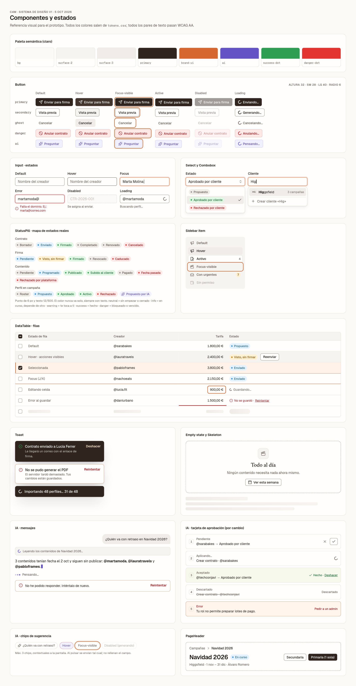

"—" significa que el estado no aplica a ese componente.

### 3.1 Button
Variantes:
- `primary`: uno por vista.
- `secondary`: contorno `border-strong`.
- `ghost`
- `danger`: tinte `danger-muted` y texto `danger`. Para acciones destructivas, siempre con confirmación.
- `ai`: tinte `ai-muted` y texto `ai`. Solo abre o envía a la IA.

Tamaños: `sm` 28, `md` 32, `lg` 40. Botón de icono cuadrado con el mismo alto. Radio 6. `label-13` (lg: `label-14`). Icono de 16 px con 6 px de separación.

| Estado | Visual | Comportamiento |
|---|---|---|
| default | Según variante. Primary con `e1` e `inset 0 1px 0 white/8%` | — |
| hover | primary → `primary-hover`; secondary → `surface-2`; ghost → `surface-3` + `fg` | 120 ms |
| focus-visible | Anillo `focus` de 2 px a 2 px | Solo con teclado |
| active | `translateY(1px) scale(.99)` | 80 ms |
| disabled | Opacidad 45 %, sin sombra, `cursor: not-allowed` | Con `Tooltip` que explique por qué (p. ej. «Falta el email del creator») |
| loading | Spinner de 14 px + verbo en gerundio («Enviando…»), mismo ancho mínimo | `aria-busy="true"`, no admite doble clic; si tarda más de 10 s, toast de error |
| error | No hay estado de error en el botón: el error va en toast o en `Field` | — |
| empty / selected | — (para conmutar se usa `Toggle` o `seg`) | — |

### 3.2 Input, Select, Combobox
Alto 34 (32 en barras de herramientas), radio 6, borde `border-strong`, fondo `surface`, `copy-14`, placeholder en `fg-subtle`.

| Estado | Input | Select | Combobox (creator, cliente) |
|---|---|---|---|
| default | Como arriba | Igual + `chevrons-up-down` de 14 px | Igual + icono de búsqueda |
| hover | Borde `fg-muted` | Igual | Igual |
| focus-visible | Borde `focus` + halo de 3 px al 22 % | Igual; abre con ↓, Espacio o Intro | Escribir filtra; ↑↓ mueve, Intro elige, Esc cierra |
| active / open | — | Menú `e2`, radio 8, items de 32 px; el elegido lleva `check` | Listbox con coincidencias en negrita; al final «Crear cliente «…»» |
| disabled | Fondo `surface-2`, borde discontinuo, texto `fg-subtle` + ayuda («Se asigna al enviar») | Igual | Igual |
| loading | Spinner a la derecha + ayuda «Buscando perfil…» | Skeleton de 3 items | «Buscando…» en el listbox (`aria-busy`) |
| error | Borde `danger` + halo 15 % + mensaje con icono | Igual | Igual |
| empty | Placeholder con ejemplo real («Ej.: @martamoda») | «Sin opciones» | «No hay creators con «xyz». Crear perfil» |
| selected | — | Valor en `fg`; StatusPill si el valor es un estado | Avatar + nombre + metadato («3 campañas») |

Combobox: `aria-controls` solo cuando el listbox está montado (corrección de axe P1.3).

### 3.3 Field (P1.2)
Estructura:
1. `label` (`label-13`), con «(opcional)» en `fg-subtle` si no es obligatorio. No se usan asteriscos.
2. Control.
3. `help` (`copy-12`, `fg-muted`).
4. `error` (`copy-12`, `danger`, icono `circle-alert` de 14 px), que sustituye a la ayuda.

Ids estables y `aria-describedby` apuntando a ayuda y error. Al enviar con errores, el foco va al primer campo inválido. Los mensajes de error dicen qué hacer, con un ejemplo: «Al NIF le falta la letra final. Ejemplo: 12345678Z».

### 3.4 StatusPill
Alto 22, radio full, punto de 6 px (`-dot`) + `label-12` en el color del tono sobre `-muted`. Contraste del texto entre 5,04 y 5,75:1 en claro.

**Mapa de estados reales.** Todos los estados salen del esquema Prisma.

| Dominio | Valor → etiqueta → tono |
|---|---|
| Contrato (`status`) | `DRAFT` Borrador · neutral; `SENT` Enviado · info; `SIGNED` Firmado · success; `COMPLETED` Completado · neutral; `RENEWED` Renovado · neutral; `CANCELLED` Cancelado · danger |
| Firma (`SignatureRequest.status`) | `PENDING` Pendiente · info; `VIEWED` Visto, sin firmar · warning; `SIGNED` Firmado · success; `REVOKED` Revocado · neutral; caducado (`expiresAt < ahora`, derivado) · danger |
| Contenido (`Deliverable.status`) | `PENDING` Pendiente · neutral; `SCHEDULED` Programado · info; `PUBLISHED` Publicado · success; `SUBMITTED` Subido al cliente · success; pagado (`paidAt`) · neutral; rechazado por plataforma (`platformSubmitError`) · danger; fecha pasada (`scheduledFor < hoy` y no publicado, derivado) · danger |
| Perfil en campaña (`CampaignTalent.status`) | `ROSTER` Roster · neutral; `PROPOSED` Propuesto · info; `APPROVED` Aprobado · success; `ACTIVE` Activo · success; `REJECTED` Rechazado · danger |
| Campaña | `ACTIVE` En curso · info; `CLOSED` Cerrada · neutral |
| IA | «Propuesto por IA» · `ai`, con icono `sparkles` y sin punto |

| Estado | Comportamiento |
|---|---|
| default | Estático, no clicable |
| hover / focus | Si la pill es un filtro, se envuelve en un botón: contorno `border` + anillo de foco |
| selected | En un Select de estado, la pill del elegido lleva `check` |
| loading | Skeleton pill de 84 × 20 |
| empty | No se pinta. La celda muestra «—» en `fg-subtle` |

Mantener `PAYEE_KIND_LABELS` y demás diccionarios en `lib/domain/labels.ts`, con una única fuente de etiquetas y tonos.

### 3.5 DataTable (fila)
Cabecera sticky de 34 px (`surface-2`, `label-12`, `fg-muted`). Filas de 44 o 56 px. Separador `border`. Celdas numéricas alineadas a la derecha y con `tabular-nums`. Checkbox en la primera columna.

| Estado | Visual | Comportamiento |
|---|---|---|
| default | Fondo `surface` | Clic en la fila abre el detalle (Sheet o página); clic en el checkbox selecciona |
| hover | Fondo `surface-2`; aparecen las acciones de fila (botón sm, «Reenviar») | Las acciones también son accesibles por teclado (no solo en hover) |
| focus-visible | Líneas `focus` arriba y abajo (`inset 0 ±1px`) | J/K o ↑/↓ mueven el foco de fila; Intro abre; X selecciona |
| active | — | — |
| selected | Fondo `brand-muted` al 70 % + barra izquierda `brand-ui` de 2 px; checkbox relleno `primary` | Aparece la barra flotante de acciones en lote (`e3`, `primary`): «2 seleccionados · Cambiar fecha · Marcar publicados · ×» |
| editando celda | La celda lleva anillo `focus` de 2 px + halo | Intro guarda, Esc cancela, Tab pasa a la siguiente celda editable |
| loading (guardando) | Spinner de 10 px + «Guardando…» en la celda de estado | `role="status"` |
| error | Subrayado `danger` de 2 px en la celda + «No se guardó · Reintentar» | El valor anterior se conserva; Reintentar reenvía |
| empty (tabla) | Empty state centrado dentro del contenedor de la tabla (§3.12) | — |
| loading (tabla) | 6 filas skeleton con anchos variables | Tras 300 ms |
| tocada por IA | Fondo `ai-muted` al 60 % + barra `ai`; celda con diff «~~Propuesto~~ → Aprobado» | Hasta que se acepte o descarte |

Por debajo de 760 px, la tabla pasa a **lista de tarjetas**: avatar, título, una línea de metadatos y la pill a la derecha. Cada fila tiene un mínimo de 60 px de alto.

### 3.6 Sidebar item
Alto 30, radio 6, icono de 16 + `label-13`, color `fg-muted`.

| Estado | Visual |
|---|---|
| default | `fg-muted` |
| hover | Fondo `surface-3`, `fg` |
| focus-visible | Anillo `focus` |
| active (ruta actual) | Fondo `surface`, `e1` + borde interior `border`, `fg`; `aria-current="page"` |
| con contador | Contador a la derecha en `fg-subtle`. Si hay urgentes, pill `warning-muted` con número `warning` y peso 600 |
| disabled | No se muestra. Los items sin permiso se filtran con `can()` (P2.1) |
| colapsado (rail de 64 px) | Solo icono, centrado, con `Tooltip` a la derecha que incluye el atajo |
| grupo | Título de grupo `label-12`, `fg-subtle`. «Admin» se pliega con chevron |

Grupos (P2.1):
- **Operación:** Campañas, Creators, Contenidos.
- **Dinero:** Contratos, Finanzas, Clientes.
- **Admin:** Equipo, Estado, Auditoría. Plegado y solo visible para Admin.

Arriba: Centro de acciones y Asistente. Debajo: «Campañas fijadas» [nuevo] (un cuadrado de 8 px con color por campaña) y, al pie, usuario y ajustes.

### 3.7 Command palette (⌘K)
Ancho 640, radio 16, `e3`, a 12vh del borde superior, scrim al 28 %.
- Input de 52 px a 15 px.
- Lista con grupos (Creators, Contratos, Campañas, Contenidos, Acciones). Items de 38 px; coincidencias en negrita (`mark`); pill de estado a la derecha.
- Pie con atajos: `↑↓ moverse · ↵ abrir · ⌘↵ abrir en panel · > comandos`.

| Estado | Comportamiento |
|---|---|
| default (vacío) | Muestra «Recientes» (últimos 5 objetos abiertos) y «Acciones»: Nueva campaña, Añadir perfil, Ir a Contenidos… |
| typing / loading | Resultados locales al instante; los remotos (`/api/creators/search`) con un debounce de 150 ms; un skeleton de 3 filas si tarda más de 300 ms |
| selected | Fondo `surface-3` en el item activo; `aria-activedescendant` |
| empty | «Nada con «xyz». ¿Quieres preguntárselo al asistente?» + item `⌘J` |
| error | «No he podido buscar ahora. Reintentar» (item) |
| `>` | Modo comandos: solo acciones |

Última opción fija: «Preguntar al asistente: «…»», que abre ⌘J con la consulta.

### 3.8 PageHeader (P2.2)
Composición:
- Migas en la topbar.
- Fila con título (`heading-24`) + StatusPill + hueco derecho: 0–1 secundario + **1 primario** + menú ⋯.
- Fila de metadatos (`copy-13`, `fg-muted`, iconos de 14 px): cliente, fechas, responsable.
- Debajo, pestañas opcionales de 40 px con subrayado de 2 px `fg` y contador en pill `surface-3`.

| Estado | Comportamiento |
|---|---|
| default | Como arriba |
| loading | Skeleton del título de 240 × 24 + pill |
| error | Si falla la carga, la página entera muestra el error (§5.1). La cabecera no |
| con cambios sin guardar | No aplica: el autosave vive en la topbar («Guardado») |
| móvil | Primario a todo el ancho bajo el título; secundarios dentro de ⋯ |

### 3.9 Sheet
Lateral derecho de 440 px, `e3`, scrim al 18 %, `role="dialog"` + `aria-modal`.
- Cabecera de 52 px: estado + posición «3 de 9» + ↑↓ + ×.
- Cuerpo con scroll.
- Pie sticky: estado de guardado a la izquierda y primario a la derecha.
- En móvil, pantalla completa (desde abajo).

| Estado | Comportamiento |
|---|---|
| abrir / cerrar | 240 / 180 ms. Esc o × cierran; el foco vuelve a la fila de origen |
| navegación | J/K o ↑↓ pasan al siguiente o anterior objeto sin cerrar |
| loading | Skeleton del cuerpo |
| error de guardado | Field con error + toast si es de red |
| sin cambios | El pie muestra «Guardado» |

### 3.10 Toast (sonner, ya en el repo)
Abajo a la derecha en escritorio y arriba en móvil. Ancho 360, radio 8, `e3`.
- Éxito: fondo `primary`, icono `success-dot` y acción en color de marca claro («Deshacer»).
- Error: fondo `surface`, borde `danger` al 30 % y acción «Reintentar» en `danger`.

| Tipo | Duración | Ejemplo |
|---|---|---|
| éxito | 5 s; 10 s si lleva «Deshacer» | «Contrato enviado a Lucía Ferrer» · «Le llegará un correo con el enlace de firma.» · Deshacer |
| error | Persistente hasta cerrar | «No se pudo generar el PDF» · «El servidor tardó demasiado. Tus cambios están guardados.» · Reintentar |
| progreso | Mientras dure | «Importando 48 perfiles… 31 de 48» |
| info | 5 s | «Enlace copiado» |

Como máximo 3 apilados. `aria-live="polite"` (los errores, `assertive`). Pausa al pasar el ratón o al enfocar.

### 3.11 Skeleton
- Bloques `surface-3` con radio 4, sin texto; alto de 12 px por línea y 14 px por título.
- Se muestran **tras 300 ms** y se mantienen un mínimo de 400 ms para no parpadear.
- Reproducen la forma real: filas de tabla con columnas, KPI y cabecera.
- Brillo de 1,4 s, que se quita con reduced-motion.

### 3.12 Empty state
Contenedor con borde discontinuo `border-strong`, radio 12 y padding 28.
- Icono de 20 px en un cuadrado de 44 (`surface-2`, radio 12).
- Titular **Newsreader 22/28**.
- Frase de 1 línea en `fg-muted`.
- Una acción (secundaria, o primaria si es el primer uso).

Hay tres tipos:
- **Primer uso:** invita a crear.
- **Todo al día:** celebra sin ruido.
- **Filtro sin resultados:** ofrece «Quitar filtros».

Copys en §5.1.

### 3.13 IA · tarjeta de aprobación
Contenedor radio 12, borde `ai` al 28 %, `e2`.
- **Cabecera:** fondo `ai-muted` al 55 % con icono `git-pull-request-arrow`, «**Navidad 2026** // 4 cambios» y el progreso «2/4» a la derecha.
- **Filas de cambio:** rejilla `20px 1fr auto`, con:
  - número (Geist Mono 11 en un cuadrado de 20);
  - «qué» (`label-12`, `fg-subtle`: «Cambiar estado · @sarabakes»);
  - «detalle» (`copy-13`): `~~Propuesto~~ → [Aprobado]` o «1 × Reel · coste 1.800,00 € · venta US$ 2.700,00»;
  - acciones: × (descartar, ghost) y ✓ (aceptar, secondary), de 28 px.
- **Pie:** fondo `surface-2`, con nota de seguridad y primario «Aceptar N restantes».

| Estado de fila | Visual | Correspondencia en AI SDK (`toolApproval`) |
|---|---|---|
| pendiente | Fila normal + ×/✓ | parte de tool con `state: 'approval-requested'` y `!part.approval.isAutomatic`, política `'user-approval'`; el motivo, si existe, en `part.approval.requestReason` |
| focus-visible | Anillo `focus` en ✓ | Y acepta, N descarta, ↑↓ mueve |
| aceptado (decidido) | Fondo `success-muted` al 45 %; número en verde; «✓ Aceptado» | `addToolApprovalResponse({ id: part.approval.id, approved: true })`. Todavía no se ha ejecutado nada |
| aplicando | Spinner + «Aplicando…» en las filas aceptadas | Cuando **todas** las filas de la tarjeta tienen decisión, `sendAutomaticallyWhen: lastAssistantMessageIsCompleteWithApprovalResponses` reenvía y las herramientas aprobadas se ejecutan |
| hecho | «✓ Hecho · Deshacer» (10 s) | Parte de tool en `output-available`. «Deshacer» lanza la acción inversa, que también deja `AuditEvent` [nuevo] |
| descartado | Detalle tachado en `fg-subtle`; «↶ Descartado» (clic para reabrir) | `addToolApprovalResponse({ id: part.approval.id, approved: false })` |
| aviso | Caja `warning-muted` dentro de la fila: «No tiene email de contacto: no se podrá enviar a firma.» | Validación del lado de la herramienta antes de proponer |
| error | Borde `danger` al 35 %; «Tu rol no permite preparar lotes de pago. · Pedir a un admin» | regla `{ type: 'denied', reason }` cuando `!can(role, …)`; llega como aprobación automática (`part.approval.isAutomatic`) con el motivo |
| empty | No se pinta la tarjeta; el asistente responde solo con texto | — |

Por eso la cabecera muestra «2/4» y el pie dice «Aceptar N restantes»: el lote se ejecuta junto cuando no queda nada pendiente. Al ejecutarse, la fila afectada en la pantalla de detrás destella `ai-muted` durante 1.200 ms (§2.8).

### 3.14 IA · mensaje de chat
- **Usuario:** burbuja `surface-3` alineada a la derecha, radio `14 14 4 14`, ancho máximo 86 %, `copy-14`.
- **Asistente:** sin burbuja, texto `copy-14` a todo el ancho; negrita para entidades (@handles, importes).
- **Paso de herramienta:** línea compacta con borde `border`, fondo `surface-2` y radio 8, plegable con chevron. Ejemplos: «✓ Ha leído la Planilla de Navidad 2026 · 8 filas» o, mientras ejecuta, «◌ Leyendo los contenidos de Navidad 2026…». Patrón de AI Elements `Tool` y del «added to context» de Linear.

| Estado | Visual |
|---|---|
| pensando | 3 puntos `ai` (opacidad .35/.65/1) + «Pensando…» |
| streaming | Texto que crece + cursor `ai` de 7 × 15 px |
| completo | Sin cursor; acciones de mensaje al pasar el ratón: Copiar · Reintentar |
| error | Caja `danger` compacta: «No he podido responder. Inténtalo de nuevo.» · Reintentar |
| empty (conversación nueva) | Saludo según la pantalla + 3 chips |

### 3.15 IA · chips de sugerencia
Alto 28, radio full, borde `border`, `copy-12`/`label-12`, icono opcional de 14. Como máximo 3, según el contexto de la ruta (`campaignId`, `contractId`, `creatorId`). Al pulsar, **se envían tal cual** (no rellenan el campo).

| Estado | Visual |
|---|---|
| default | `surface` + `fg-muted` |
| hover | Borde `ai` al 40 %, fondo `ai-muted`, texto `ai` |
| focus-visible | Anillo `focus` |
| active | `scale(.98)` |
| disabled | Opacidad 45 % mientras el asistente genera |
| loading | — (el chip desaparece al enviarse) |

---

## 4. Pantallas clave

Las medidas están en px CSS. La captura de 1440 está hecha a 1440 × 900 (DPR 1,5); la de 375, a 375 × 812 (DPR 2). Las maquetas son HTML/CSS estático con los tokens de §2, en `mockups/<pantalla>.html`. Ábrelas en Chrome para inspeccionar medidas.

### 4.0 AppShell y ⌘K (P2.1)

```
1440 ─────────────────────────────────────────────────────────────────────────────
│ SIDEBAR 240 (surface-2)      │ TOPBAR 52 · migas ·············· Guardado · ⌘J │
│ [C4M] Creators for Media ⇅   ├────────────────────────────────────────────────│
│ [⌕ Buscar o saltar a…   ⌘K]  │                                                │
│ ▣ Centro de acciones    (5)  │   PageShell (default 1120 · wide 1240 · full)  │
│ ✦ Asistente                  │   padding 24/32                                │
│ Operación                    │                                                │
│   Campañas  6 · Creators     │                                                │
│   Contenidos                 │                                                │
│ Dinero                       │                                                │
│   Contratos 4 · Finanzas     │                                                │
│   Clientes                   │                                                │
│ › Admin                      │                                                │
│ Campañas fijadas             │                                                │
│   ■ Navidad 2026             │                                                │
│ ──────────────────────────── │                                                │
│ (ÁR) Álvaro Romero · Admin ⚙ │                                                │
1024: sidebar → rail de 64 px (iconos + tooltip)   375: barra inferior de 64 px
     Acciones · Campañas · Contenidos · Asistente · Más (Sheet con el resto)
```

- **⌘K** (captura `command-palette-1440.png`). Busca creators (`/api/creators/search`), contratos por código o nombre, campañas y contenidos, más las acciones. Si nada encaja, la última fila ofrece «Preguntar al asistente: «…»».
- **Móvil.** La lupa de la topbar abre ⌘K a pantalla completa.

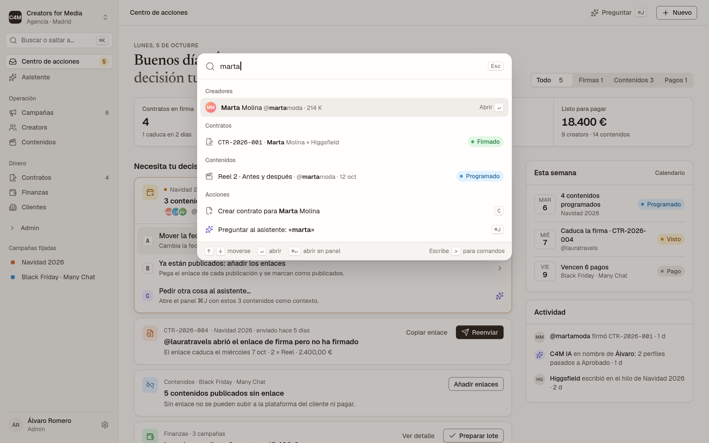

### 4.1 Panel = Centro de acciones (P2.6)

**Objetivo.** Ver al entrar qué está parado y resolverlo sin navegar.

```
┌ topbar: Centro de acciones ······························ ✦ Preguntar ⌘J · + Nuevo ┐
│ LUNES, 5 DE OCTUBRE (eyebrow)                                                  │
│ Buenos días, Álvaro. Hay 5 cosas que esperan            [Todo 5|Firmas 1|…]   │ display-30
│ una decisión tuya. (fg-muted)                                                  │
│ ┌ Contratos en firma ┬ Contenidos esta semana ┬ Fecha pasada ┬ Listo pagar ┐  │ KPI 4 segmentos
│ │ 4 · 1 caduca en 2 d│ 9 · 5 prog. · 4 pend.  │ 3 (danger)   │ 18.400 €    │  │ bordeados (Passionfroot)
│ └────────────────────┴────────────────────────┴──────────────┴─────────────┘  │
│ Necesita tu decisión [Urgente 1]        J/K moverte · E resolver │ Esta semana │
│ ┌ ● Navidad 2026 · Higgsfield · desde el viernes ────────────┐   │ MAR 6 …     │
│ │ ⚠ 3 contenidos tenían fecha el 2 oct y siguen sin publicar │   │ MIÉ 7 …     │ lateral 340
│ │ (MM)(LT)(PF) @martamoda, @lauratravels y @pabloframes      │   │ VIE 9 …     │
│ │ [A] Mover la fecha al jueves 8 oct                       › │   ├─────────────│
│ │ [B] Ya están publicados: añadir los enlaces              › │   │ Actividad   │
│ │ [C] Pedir otra cosa al asistente…                        ✦ │   │ …           │
│ └────────────────────────────────────────────────────────────┘   │             │
│ ┌ CTR-2026-004 … abrió el enlace pero no ha firmado [Copiar enlace][Reenviar] ┐ │
│ ┌ 5 contenidos publicados sin enlace                          [Añadir enlaces] ┐ │
│ ┌ Lote de pago listo: 9 creators · 18.400 €    [Ver detalle][✓ Preparar lote] ┐ │
│ ┌ Higgsfield rechazó la subida de 1 contenido                 [Revisar enlace] ┐ │
│ ✓ Resueltas hoy: 2 · Ver historial                                             │
```

**Medidas y rejilla**
- Contenido `minmax(0,1fr) 340px` con 28 px de gutter.
- Tarjeta de acción: padding 14/16, icono en cuadrado de 32 con tinte del tono, título `heading-14` (14,5/21), metadatos `copy-12` `fg-subtle`, acciones a la derecha en `btn-sm`.
- La tarjeta más urgente va primero, con borde `warning-dot` al 45 %, `e2` y opciones A/B/C en filas de 8/10 px con la tecla en `kbd` de 22 px.

**Contenido.** Todo sale de datos reales:
- `expired_signature` y `unsigned_published` (`ops-alerts.ts`).
- `SignatureRequest.status = VIEWED` + `expiresAt`.
- `Deliverable.scheduledFor` vencido, `postUrl` vacío, `clientSubmittedAt` + `paymentDueAt` cumplido (lote) y `platformSubmitError`.
- `CampaignMessage` de tipo `CLIENT`.

**Orden.** Gravedad (danger > warning > info), después antigüedad. Agrupado por campaña cuando hay más de 3 de la misma.

**Interacciones**
- J/K mueven entre tarjetas; A/B/C eligen opción en la enfocada; Intro ejecuta el botón principal de la tarjeta; E marca como resuelta y la saca de la lista con «Deshacer».
- Las opciones que cambian datos (A, «Preparar lote») piden confirmación en línea («¿Mover 3 fechas al 8 oct? Mover · Cancelar») o pasan por el flujo IA (C).
- El segmentado filtra por tipo.

**Responsive**
- **1024:** el lateral baja a 2 columnas debajo y el sidebar pasa a rail (`centro-acciones-1024.png`).
- **375:** KPI en 2 × 2, botones de tarjeta a todo el ancho bajo el texto, sin pistas de teclado.

[nuevo] Los contadores «Resueltas hoy» y «Esta semana» se calculan sobre `AuditEvent` y fechas de contenidos y pagos. El job diario P3.3 puede precalcular la lista.

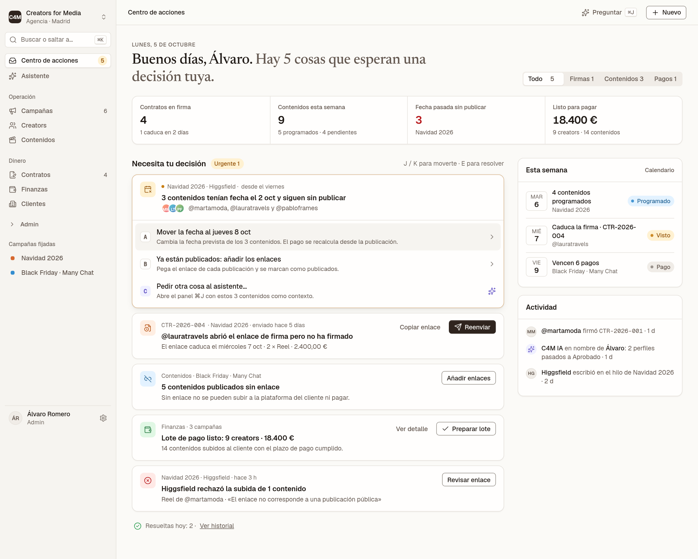

| 1024 | 375 |
|---|---|
| 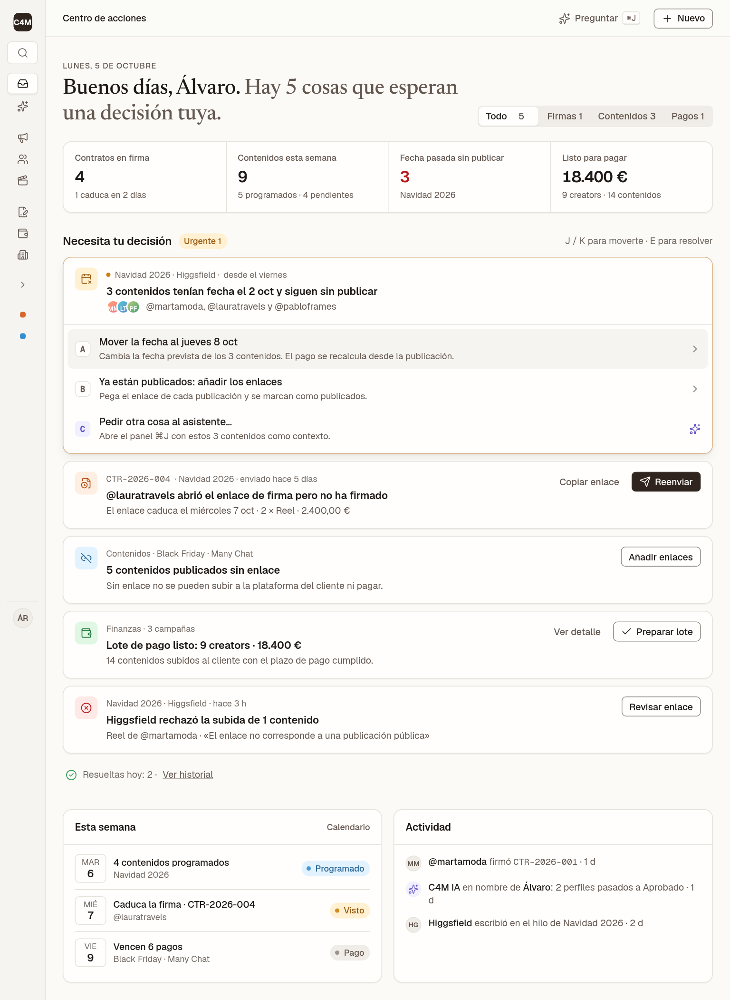 | 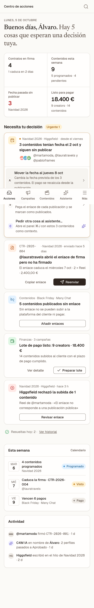 |

### 4.2 Campaña · Planilla (P2.5)

**Objetivo.** La campaña es la unidad central. La Planilla responde a tres preguntas: quién está, cuánto cuesta y vende cada uno, y en qué punto está su contrato.

```
┌ topbar: Campañas › Navidad 2026 ············· ☁ Guardado · ✦ Preguntar ⌘J ┐
│ [🎄] Navidad 2026 (●En curso)          [Compartir con cliente] [+ Añadir perfil] │
│      ▣ Higgsfield · 📅 1 nov – 31 dic · 👤 Álvaro Romero                         │
│ Planilla 8 │ Mesa │ Contratos 4 │ Contenidos 13 │ Hilo │ Brief                   │
│ ┌ Presupuesto de venta ┬ Venta comprometida ▓▓▓░ 42 % ┬ Margen medio ┬ Publicados ┐│
│ [⌕ Filtrar creators… /] [≡ Estado] [Todas|IG 4|TT 3|YT 1]     Columnas · Exportar │
│ ☐ Creator          Mediana  Contenidos  Coste     Venta        Margen Estado  Contrato │
│ ☐ (MM) Marta Molina  48,2 K  4 × Reels  4.200,00 € US$ 6.400,00  24 %  ●Activo CTR-2026-001 Firmado │
│ ☐ (LT) Laura Torres  21,5 K  2 × Reels  …                         ●Activo CTR-…004 Visto, sin firmar [Reenviar] │
│ ☑ (PF) …  (fila seleccionada · celda «Venta» en edición)                         │
│ …                                                                                │
│ 7 creators · sin rechazados   15 contenidos  21.750,00 €  US$ 32.650,00  22 %     │
│ Venta en US$ · coste en la moneda de cada creator · 1 US$ = 0,86 €               │
```

**Columnas** (todas del modelo `CampaignTalent` y `Creator`):
1. Creator: avatar 28 + nombre `label-13` + `@handle` con icono de plataforma (`contentPlatform`).
2. Mediana: `igMedianViews`. Tooltip «Mediana de visualizaciones en Instagram · actualizada hace N días».
3. Contenidos: `deliverableCount × contentFormat`.
4. Coste: `costMinorPerContent × n`, en `costCurrency`.
5. Venta: `salePriceCentsPerContent × n`, en US$.
6. Margen: derivado con el cambio del momento; en el contrato, el fijado.
7. Estado: `CampaignTalent.status`.
8. Contrato: código + estado de firma en texto de color.
9. Acción contextual.

**Edición en línea.** Coste, venta y estado se editan en la celda: Intro guarda, Esc cancela, autosave con «Guardado» en la topbar.

**Medidas**
- PageShell `wide`.
- Filas de 44.
- Cabecera de campaña: emoji o portada de 44 × 44 + `heading-24`; metadatos con iconos de 14.
- KPI en 4 segmentos de 14/16 de padding con cifra `heading-20`.
- Barra de herramientas de 28 px de alto.

**Interacciones**
- `/` enfoca el filtro.
- La selección múltiple abre la barra de acciones en lote: Cambiar estado · Generar contratos · Exportar.
- «Generar contrato» aparece en las filas `APPROVED` sin contrato.
- «Añadir perfil» abre el alta unificada en un Sheet con `campaignId` prefijado (P2.5: sustituye «Registrar influencer»).
- Clic en el nombre abre la ficha del creator en un Sheet.

**Responsive**
- **1024:** se ocultan Mediana y Margen; el estado de firma pasa a tooltip.
- **375:** lista de tarjetas (handle, n × formato · coste, pill y código de contrato) con totales al pie; pestañas con scroll horizontal; KPI en 3 columnas.

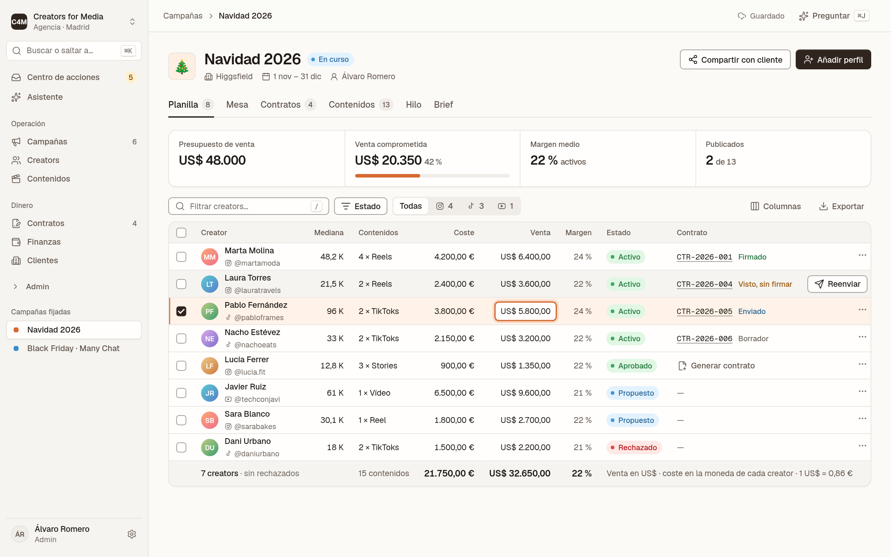

| 1024 | 375 |
|---|---|
| 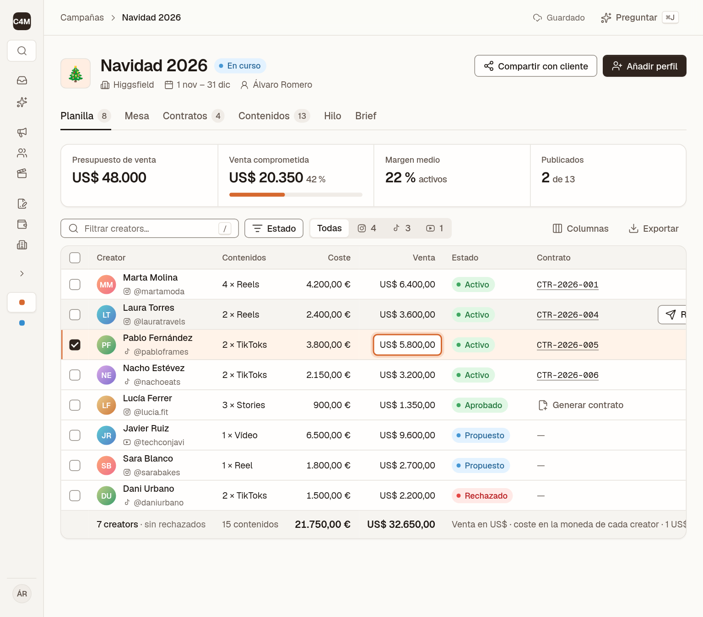 | 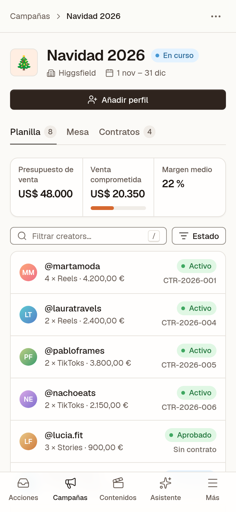 |

### 4.3 Contrato · pestañas + CTA sticky (P2.3)

**Objetivo.** Que en un primer vistazo se vea en qué paso está el contrato y cuál es el siguiente. Meta de la auditoría: menos de 1.400 px de alto en escritorio, incluso con 34 contenidos.

```
┌ topbar: Navidad 2026 › Contratos › CTR-2026-007 ················· 1/6 ↑ ↓ ⋯ ┐
│ CTR-2026-007 (●Borrador)                               [Ver PDF] [✦ Revisar con IA] │
│ Lucía Ferrer × Higgsfield                                                   │ heading-24
│ Navidad 2026 · 3 × Story · venta US$ 1.350,00 · creado por ti hace 20 min    │
│ ┌ (1) Borrador ──── (2) Enviado ──── (3) Firmado ──── (4) Completado ┐     │ stepper
│ Resumen │ Contenidos 3 │ Firma y pago │ Historial                           │ tabs
│ ┌ Partes ─────────────────────────────┐  ┌ Antes de enviar      5 de 5 ┐   │
│ │ (LF) Lucía Ferrer · cobra en EUR    │  │ ✓ 3 contenidos con fecha     │   │ lateral 300
│ │ (HG) Higgsfield AI Inc. · US$       │  │ ✓ Venta y coste = Planilla   │   │ sticky top 76
│ ├ Contenidos 3                + Añadir│  │ ✓ Margen > 0 · ✓ Vigencia    │   │
│ │ Story 1 · Unboxing  12 nov  Pend. 300,00 € │ ✓ Email del creator       │   │
│ │ Story 3 · Código    [📅 10 dic] …   │  ├ Firma ───────────────────────┤   │
│ ├ Importes                    ✎ Editar│  │ (LF) Lucía Ferrer · talento  │   │
│ │ Venta/contenido  US$ 450,00 × 3     │  │ ⓘ rellena sus datos al firmar│   │
│ │ Coste/contenido  300,00 € × 3       │  └──────────────────────────────┘   │
│ │ Cambio 1 US$ = 0,86 € (fijado)      │                                      │
│ │ Margen 22 % [US$ 303,49]            │                                      │
│ ├ Vigencia y pago · Notas             │                                      │
╞═ CTA sticky 64: ☁ Guardado hace 5 s · Lucía recibirá un enlace…  [Vista previa] [➤ Enviar para firma ⌘↵] ═╡
```

**CTA según estado** (un solo primario):

| Estado | CTA primario | Secundarios |
|---|---|---|
| `DRAFT` | Enviar para firma (abre un diálogo con los días de validez del enlace, `expiresInDays`) | Vista previa |
| `SENT` | Reenviar enlace | Copiar enlace · Revocar |
| `SIGNED` | Marcar contenido publicado (abre la pestaña Contenidos) | Descargar PDF firmado |
| `COMPLETED` / `RENEWED` | Renovar | Descargar PDF |
| `CANCELLED` | — (aviso con `cancelReason`) | Duplicar como borrador |

**Pestañas**
- **Contenidos:** tabla compacta de `Deliverable`, paginada de 20 en 20, que se edita en un Sheet.
- **Firma y pago:** `SignatureRequest` y datos de cobro (`PayeeProfile`) tras firmar.
- **Historial:** `AuditEvent`, con líneas tipo Linear: «Álvaro Romero envió el contrato · hace 2 h».

**Detalles**
- Navegación anterior/siguiente (J/K) entre los contratos de la campaña.
- «Antes de enviar» es la lista que el botón exige. Si algo falla, el primario se deshabilita con un tooltip que lo explica y el punto que falta queda enlazado.

**Responsive**
- **1024:** el lateral pasa debajo.
- **375:** el stepper solo muestra el paso actual con número; la tabla oculta la columna Estado; la barra sticky lleva 2 botones a todo el ancho y la barra inferior se oculta (es una tarea enfocada).

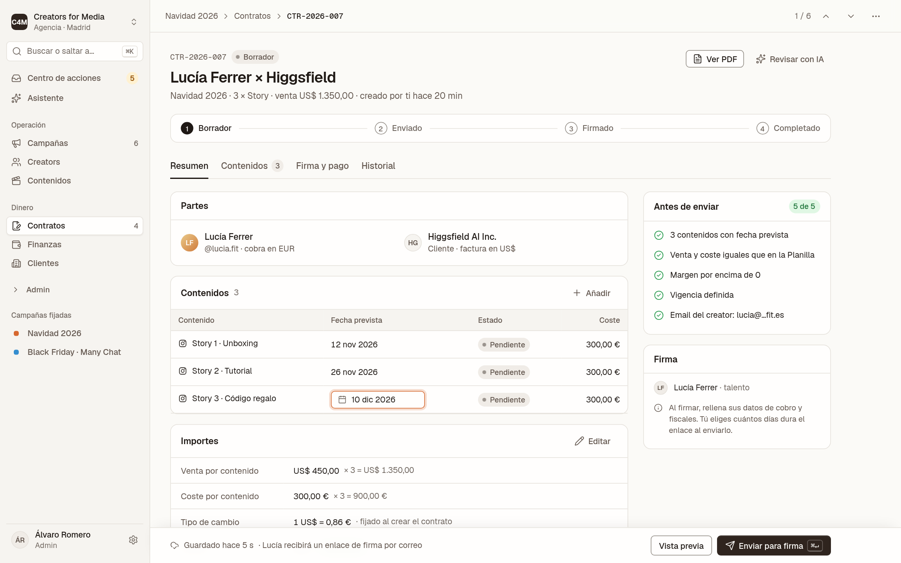

| 1024 | 375 (pantalla) | 375 (completa) |
|---|---|---|
| 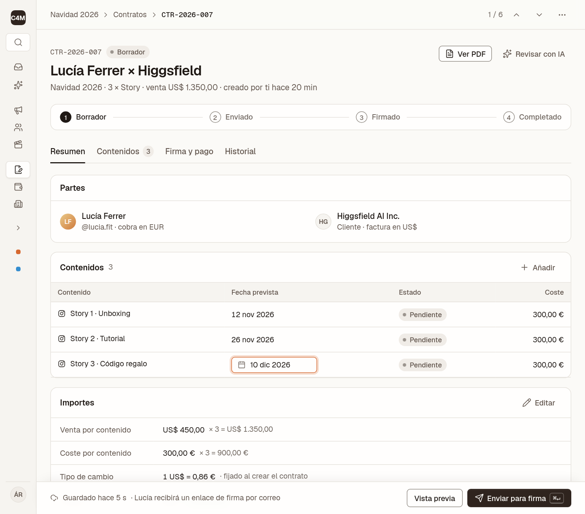 | 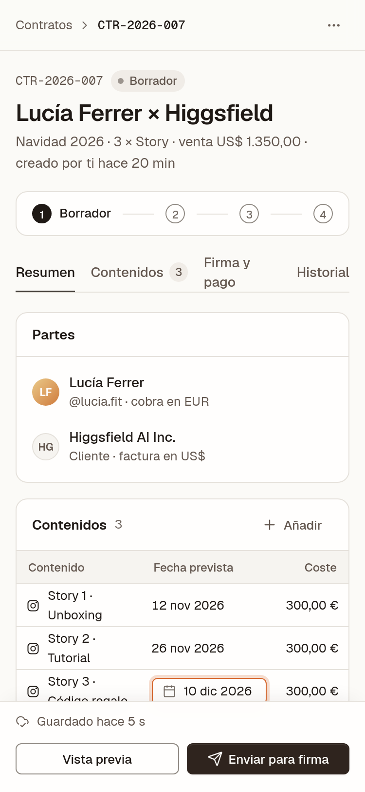 | 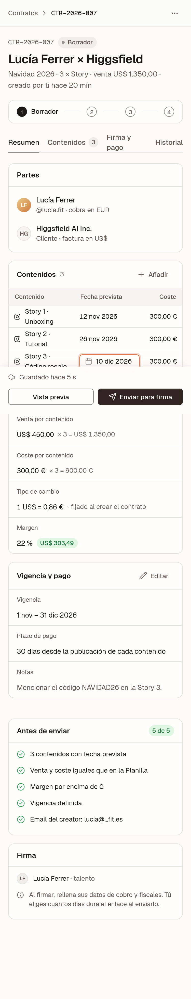 |

### 4.4 Contenidos · DataTable (P2.4)

**Objetivo.** Gestionar todos los contenidos contratados, de la fecha prevista al pago, sin abrir contrato por contrato.

```
┌ Contenidos ······························································ [Exportar CSV] ┐
│ Todos los contenidos contratados: fecha, publicación, subida al cliente y pago.  │
│ [Necesitan algo 9] Esta semana 9 · Fecha pasada 3 · Sin enlace 5 · Listos para pagar 14 · Todos 86 · + Vista │
│ (Cliente Higgsfield, Many Chat ×) (+ Filtro)              9 de 86 · ordenados por urgencia │
│ ☐ Contenido                 Creator        Estado            Fecha ↓  Enlace         Pago   │
│ ☐ [IG] Reel 1 · Unboxing    (MM) @marta…   ●Fecha pasada     2 oct    —              —      │
│   CTR-2026-001                                                                         │
│ ☐ [TT] TikTok 1 …           (PF) …         ●Fecha pasada     (fila con foco J/K)           │
│ ☑ [IG] Reel 2 · Antes y…    …              ●Programado       12 oct                         │
│ ☐ [IG] Reel · Lookbook      …              ●Rechazado por plataforma  🔗 instagram.com/reel/… │
│ ☐ [IG] Story · Código regalo …             ●Subido al cliente 1 oct   🔗 …        vence 31 oct │
│              ┌ 2 seleccionados [📅 Cambiar fecha] [🔗 Marcar publicados] × ┐ (flotante, e3) │
```

**Columnas.** Todas del modelo `Deliverable`:
- `title` + código del contrato (Geist Mono).
- Creator.
- Estado (§3.4).
- `scheduledFor` (o `publishedAt` si está publicado).
- `postUrl`.
- `paymentDueAt` / `paidAt`.

**Vistas guardadas** [nuevo, solo en cliente]. Son filtros con nombre sobre el modelo real:
- «Necesitan algo»: fecha pasada, sin enlace, rechazado por plataforma o `VIEWED` sin firmar.
- «Listos para pagar»: `SUBMITTED` + `paymentDueAt ≤ hoy` + `paidAt` nulo.

**Detalle en Sheet** (`contenidos-detalle-1440.png`):
- Enlace de la publicación con validación de unicidad (`postUrlKey` es único en todo el sistema). El error dice dónde está el duplicado: «Este enlace ya está en otro contenido: CTR-2026-003 · TikTok 1.».
- Fecha prevista, con la ayuda «Al publicar se guarda la fecha real».
- Bloque coste, venta y pago.
- Notas (solo equipo) y la última modificación.
- Pie: «Guardado» + primario «Marcar como publicado».

**Interacciones**
- J/K mueven y Intro abre el Sheet; dentro del Sheet, J/K pasan al siguiente sin cerrar.
- X selecciona. ⇧+clic selecciona un rango.
- Las acciones en lote dependen del rol: Finanzas ve «Marcar subidos» y «Preparar pago».

**Objetivo de accesibilidad** de la auditoría: 0 violaciones de *target-size* a 375 px. Las filas móviles miden 60 px o más.

**Responsive**
- **1024:** se oculta Enlace (visible en el Sheet).
- **375:** tarjetas con icono de plataforma, título, «@handle · fecha» (en `danger` si está vencida) y pill; las vistas son un segmentado con scroll.

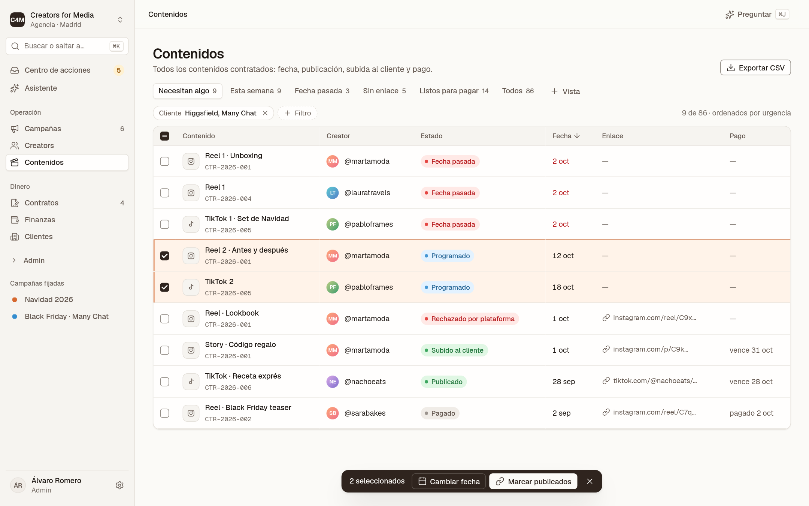

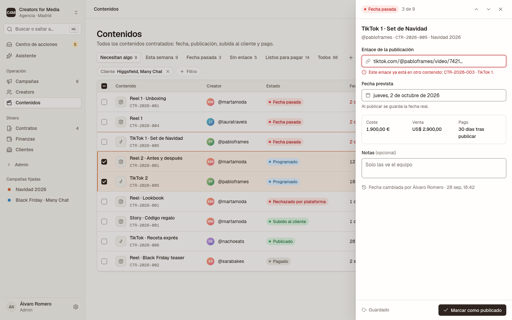

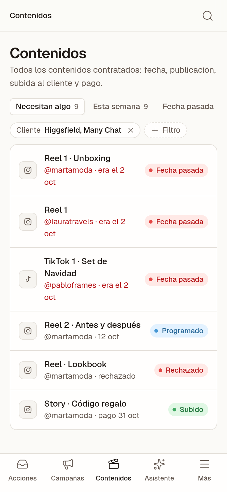

### 4.5 Firma externa · layout público (P1.5)

**Objetivo.** Que el creator entienda qué firma y cuánto cobra, y firme en una sola visita.

```
┌ [C4M] Creators for Media ······················ 🔒 Enlace personal para Lucía Ferrer · caduca el 19 oct ┐
│ CONTRATO CTR-2026-007                                                     [Descargar PDF] │
│ Hola, Lucía. Este es tu contrato con Higgsfield.                (display-30 Newsreader)  │
│ Léelo con calma. Si algo no cuadra, escríbenos antes de firmar…                          │
│ ┌ Documento (paper, padding 48/56) ──────────────┐  ┌ Firma en 2 minutos  ━━━ ━━━ ━━━ ┐ │
│ │ ACUERDO DE COLABORACIÓN                        │  │ Paso 3 de 3 · Firma               │ │
│ │ Campaña «Navidad 2026» (serif 28)              │  │ Recibes 900,00 € · 3 × Story      │ │ sticky 380
│ │ [1. Objeto][2. Entregables][3. Honorarios]…    │  │ Primera publicación 12 nov · …    │ │
│ │ 1. OBJETO …                                    │  │ ✓ Tus datos de cobro … Editar     │ │
│ │ 2. ENTREGABLES  Story 1 … 12 nov 2026          │  │ Nombre completo del firmante [  ] │ │
│ │ 3. HONORARIOS … ▒30 días después de la publicación de cada contenido▒ │ ☑ He leído y acepto │ │
│ │ 4. VIGENCIA …                                  │  │ [ ✎ Firmar contrato ] (lg)        │ │
│ └────────────────────────────────────────────────┘  │ 🛡 Guardamos fecha, IP y huella…  │ │
│ ¿Dudas? Responde al correo con el que te llegó este enlace. · Privacidad                │
```

**Pasos**
1. **Revisa** el documento.
2. **Tus datos de cobro.** Son los campos reales de `sign-form.tsx`: Firmas como, Nombre o razón social, NIF / CIF / Tax ID, País, Dirección, Ciudad, Código postal, Provincia o estado, Email de cobro (Zexel), Moneda de cobro, Tipo de IVA, Tipo de retención, Régimen fiscal, Teléfono, Persona de contacto. Van en 2 columnas a 1440 y agrupados en «Quién eres» / «Dónde cobras» / «Impuestos».
3. **Firma:** Nombre completo del firmante + Aceptación del contrato.

El paso 2 ya rellenado se resume en una línea con «Editar». El importe que recibe la persona no se pierde de vista en ningún paso.

**Detalles**
- Las cláusulas clave para el creator (cuándo cobra) llevan un resaltado `warning-muted`.
- Sin jerga interna, sin sidebar y sin enlaces a la app.
- Fecha de caducidad del enlace en la cabecera, en hora de Madrid.
- Tras firmar, la misma URL muestra arriba «Contrato firmado el … · Descargar PDF firmado» (P1.5).
- **Errores:** el NIF incompleto da «Al NIF le falta la letra final. Ejemplo: 12345678Z». Con el enlace caducado: «Este enlace ha caducado. Pide uno nuevo a tu contacto en Creators for Media.»

**Responsive**
- **1024:** documento + tarjeta de 340.
- **375:** saludo → resumen (importe) → documento; barra sticky inferior «900,00 € · 3 × Story · Paso 1 de 3 [Continuar →]», y los pasos 2–3 se abren como pantalla completa.

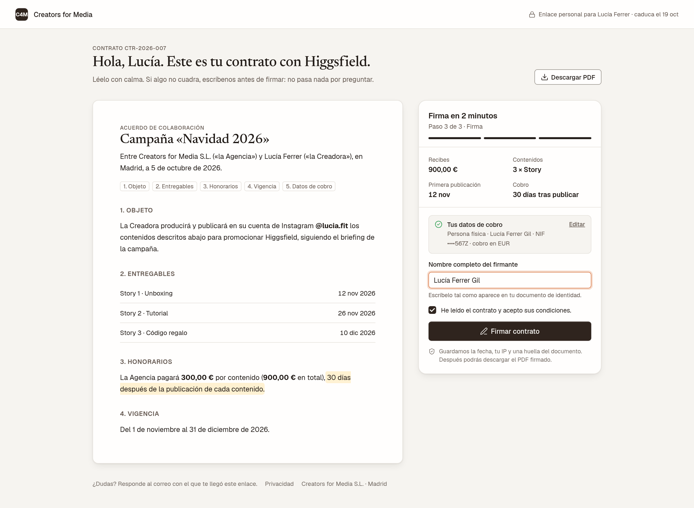

| 375 (pantalla) | 375 (completa) |
|---|---|
| 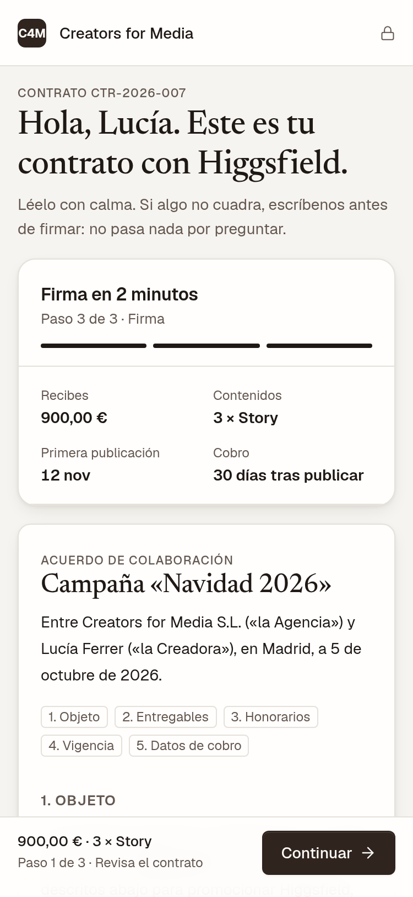 | 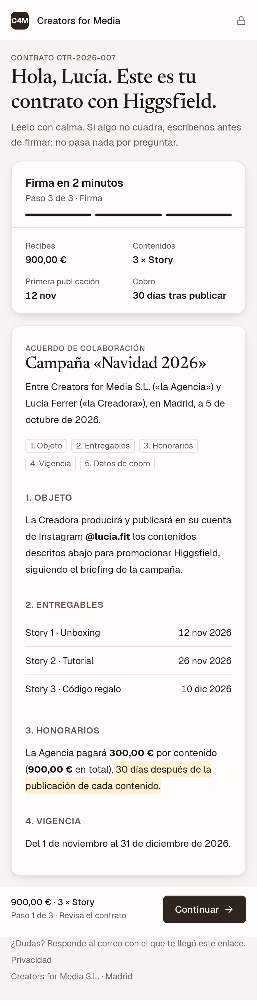 |

### 4.6 Panel IA ⌘J con flujo de aprobación (P3.2)

**Objetivo.** Pedir en lenguaje natural y aprobar cambio por cambio, sin salir de la pantalla.

```
┌ … Planilla (contenido empujado, 1fr) ───────────────┬ ASISTENTE 440 (surface) ──────────────┐
│ filas tocadas por IA: tinte ai + barra ai 2 px      │ [✦] Asistente (▦ Navidad 2026 · Planilla) ✎ × │
│ ☐ (JR) Javier Ruiz  … ~~Propuesto~~ → ●Aprobado     │            ┌ Higgsfield ha aprobado a… ┐ │ burbuja usuario
│ ☐ (SB) Sara Blanco  … ~~Propuesto~~ → ●Aprobado     │ ✓ Ha leído la Planilla … 8 filas ⌄     │ tool line
│                                                     │ Propongo 4 cambios. No se guarda nada… │
│                                                     │ ┌ ⇄ Navidad 2026 // 4 cambios    2/4 ┐ │
│                                                     │ │ 1 Cambiar estado · @techconjavi  ✓Aceptado │
│                                                     │ │ 2 Cambiar estado · @sarabakes    × [✓] │ foco
│                                                     │ │ 3 Crear contrato · @sarabakes    × [✓] │
│                                                     │ │ 4 Crear contrato · @techconjavi ↶Descartado │
│                                                     │ │   ⚠ No tiene email de contacto…    │ │
│                                                     │ │ Los contratos se crean como Borrador [Aceptar 2 restantes] │
│                                                     │ (Añade el email de @techconjavi) (¿Quién va con retraso?) … │ chips
│                                                     │ ┌ Pide algo sobre Navidad 2026…        ┐ │ composer
│                                                     │ │ @ Contexto  📎                    (↑) │ │
│                                                     │ ↵ enviar · ⇧↵ nueva línea   El asistente propone; tú decides. │
```

**Flujo**

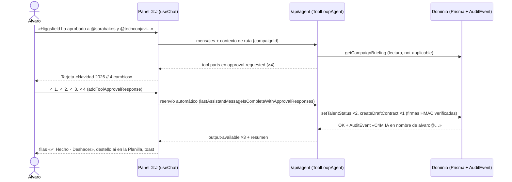
```mermaid
sequenceDiagram
  actor U as Álvaro
  participant P as Panel ⌘J (useChat)
  participant A as /api/agent (ToolLoopAgent)
  participant D as Dominio (Prisma + AuditEvent)
  U->>P: «Higgsfield ha aprobado a @sarabakes y @techconjavi…»
  P->>A: mensajes + contexto de ruta {campaignId}
  A->>D: getCampaignBriefing (lectura, not-applicable)
  A-->>P: tool parts en approval-requested (×4)
  P-->>U: Tarjeta «Navidad 2026 // 4 cambios»
  U->>P: ✓ 1, ✓ 2, ✓ 3, × 4  (addToolApprovalResponse)
  P->>A: reenvío automático (lastAssistantMessageIsCompleteWithApprovalResponses)
  A->>D: setTalentStatus ×2, createDraftContract ×1 (firmas HMAC verificadas)
  D-->>A: OK + AuditEvent «C4M IA en nombre de alvaro@…»
  A-->>P: output-available ×3 + resumen
  P-->>U: filas «✓ Hecho · Deshacer», destello ai en la Planilla, toast
```

**Reglas del panel**
- **Layout.** No es modal: empuja el contenido (columna de 440 px). ⌘J o el botón «Preguntar» lo abren y cierran.
- **Contexto.** Recibe el de la ruta y lo muestra como chip en la cabecera; «@ Contexto» añade más objetos.
- **Persistencia.** La conversación se guarda con `visibility = INTERNAL` (P0.2).
- **Política por herramienta** (P3.1):
  - Lectura: `'not-applicable'`.
  - Escritura: `'user-approval'`.
  - Dinero o envío externo (`queueSignatures`, `preparePayoutBatch`, `draftClientMessage`): `'user-approval'`, o `{type:'denied', reason}` si el rol no puede.
  - Con `experimental_toolApprovalSecret` (`TOOL_APPROVAL_SECRET`), para que una aprobación no se pueda falsificar desde el cliente.
- **Herramientas nuevas.** `setTalentStatus` y `createDraftContract` no están en la lista de herramientas del P3.1; hay que añadirlas, envolviendo las funciones que hoy usan la Planilla y el alta de contrato.
- **Validación antes de proponer.** El asistente comprueba los datos y adjunta avisos en la fila: sin `contactEmail` no se puede enviar a firma; margen negativo; fecha fuera de la vigencia.
- **Selección parcial.** Se aceptan unas filas y otras no, y la tarjeta muestra el progreso. El primario «Aceptar N restantes» resuelve las pendientes.
- **Deshacer.** Disponible 10 s en filas y toast; queda en el historial.

**Responsive**
- **1024:** panel de 380; la Planilla oculta más columnas y el diff queda solo como pill.
- **375:** pantalla completa (cubre la vista), con cabecera, conversación, chips y composer fijo abajo; se cierra con × o deslizando hacia abajo.

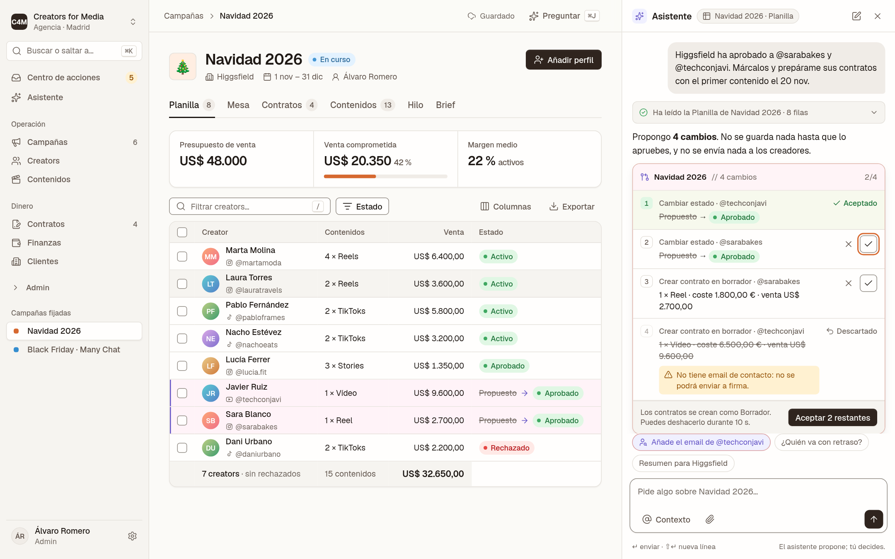

| 1024 | 375 | Oscuro 1440 |
|---|---|---|
| 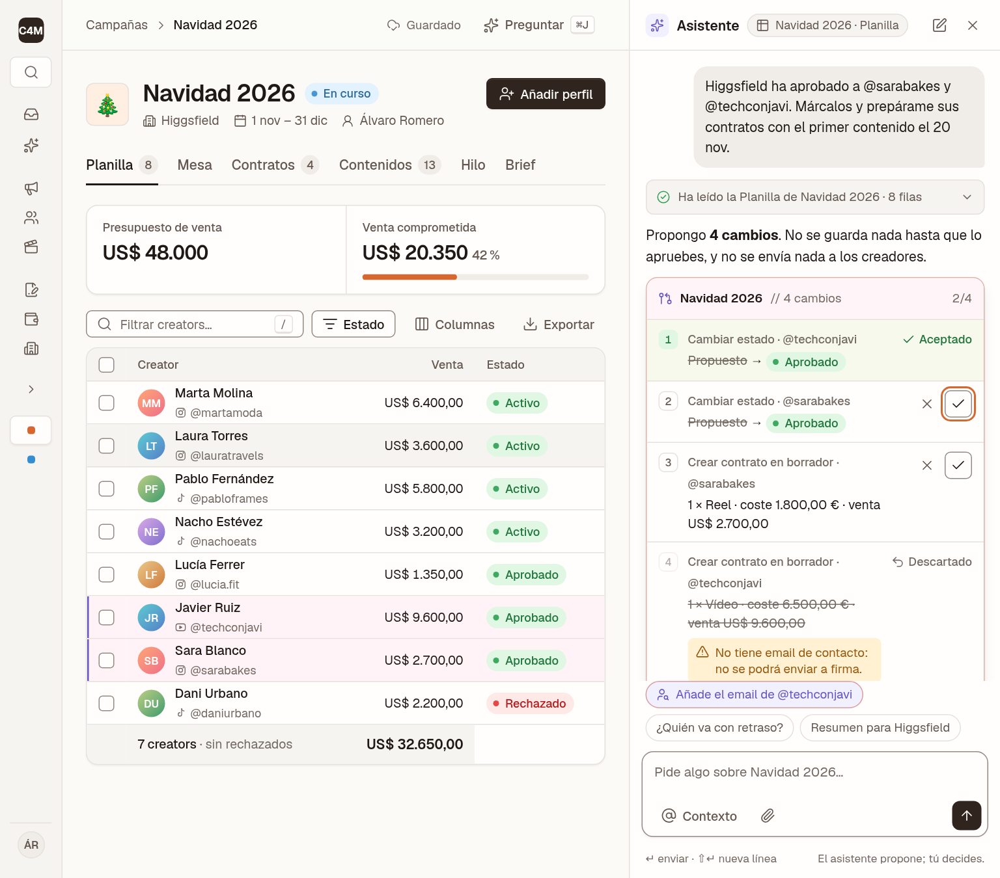 | 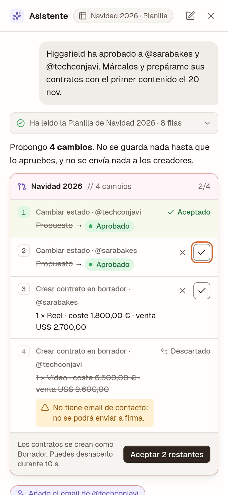 | 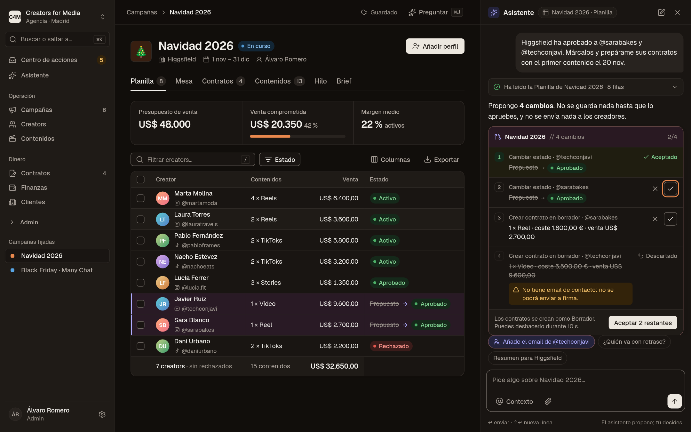 |

---

## 5. Microinteracciones y detalles

### 5.1 Copy de estados

**Tono:** frase corta, en segunda persona («tú»), orientada a la tarea, sin tecnicismos (P1.4). Las cifras y nombres van siempre en concreto.

**Estados vacíos**

| Pantalla | Titular (Newsreader) | Texto | Acción |
|---|---|---|---|
| Centro de acciones, todo resuelto | Todo al día | No hay nada que necesite tu decisión. Te avisaremos aquí cuando algo se pare. | Ver campañas |
| Centro de acciones, primer uso | Empieza por una campaña | En C4M todo cuelga de una campaña: perfiles, contratos, contenidos y pagos. | **Crear tu primera campaña** (primario) |
| Campañas | Aún no hay campañas | Crea una para añadir perfiles y preparar contratos. | **Nueva campaña** |
| Planilla | La planilla está vacía | Añade perfiles a mano o importa un Excel con los handles de Instagram. | **Añadir perfil** · Importar |
| Contratos de una campaña | Sin contratos todavía | Cuando un perfil esté Aprobado, genera su contrato desde la Planilla. | Ir a la Planilla |
| Contenidos (vista «Necesitan algo») | Todo al día | Ningún contenido necesita nada ahora mismo. | Ver esta semana |
| Contenidos con filtros | Nada con estos filtros | Prueba a quitar algún filtro. | Quitar filtros |
| ⌘K sin resultados | — | Nada con «{q}». ¿Quieres preguntárselo al asistente? | Preguntar (⌘J) |
| Panel IA, conversación nueva | — | Pregúntame por {campaña} o pídeme cambios. Te enseñaré cada cambio antes de hacerlo. | 3 chips de contexto |
| Historial del contrato | Sin actividad | Aquí verás quién creó, envió y firmó este contrato. | — |

**Carga**

| Situación | Patrón | Texto |
|---|---|---|
| Página o tabla | Skeleton con su forma (tras 300 ms) | — (sin texto) |
| Botón | Spinner + gerundio | «Enviando…», «Generando PDF…», «Preparando lote…», «Importando…» |
| Búsqueda remota | Fila de estado | «Buscando…» |
| Celda o campo con autosave | Indicador de guardado (§5.5) | «Guardando…» |
| IA pensando / herramienta | Puntos / línea de tool | «Pensando…», «Leyendo la Planilla de {campaña}…» |
| Importación larga | Toast de progreso | «Importando 48 perfiles… 31 de 48» |

**Errores**: qué ha pasado, qué no se ha perdido y qué hacer.

| Situación | Texto | Acción |
|---|---|---|
| Red caída al guardar | No se ha guardado. Revisa tu conexión; lo intentamos de nuevo en cuanto vuelva. | Reintentar |
| Servidor (500) en página | Algo ha fallado al cargar esta página. No has perdido nada. | Recargar · Ir al Centro de acciones |
| Sin permiso | Tu rol no puede {acción}. Pídeselo a un admin. | — |
| 404 de contrato | No encontramos el contrato {código}. Puede que se haya cancelado o que el enlace esté mal. | Ir a Contratos |
| Enlace de firma caducado | Este enlace ha caducado. Pide uno nuevo a tu contacto en Creators for Media. | — |
| Enlace de publicación duplicado | Este enlace ya está en otro contenido: {código} · {título}. | Ir a ese contenido |
| PDF | No se pudo generar el PDF. El servidor tardó demasiado. Tus cambios están guardados. | Reintentar |
| IA | No he podido responder. Inténtalo de nuevo. | Reintentar |
| IA, herramienta denegada | No puedo hacerlo: {reason}. | — |
| Validación (Field) | Falta el dominio. Ej.: marta@correo.com · Al NIF le falta la letra final. Ejemplo: 12345678Z · La fecha debe estar entre el 1 nov y el 31 dic 2026 (vigencia). | — |

### 5.2 Toasts (texto exacto)

| Evento | Título | Descripción | Acción / duración |
|---|---|---|---|
| Contrato enviado | Contrato enviado a {nombre} | Le llegará un correo con el enlace de firma. | Deshacer · 10 s |
| Enlace reenviado | Enlace reenviado a {nombre} | Caduca el {fecha}. | 5 s |
| Enlace copiado | Enlace copiado | — | 3 s |
| Contenidos marcados publicados | {n} contenidos marcados como publicados | El pago vence a los {n} días de cada publicación. | Deshacer · 10 s |
| Fecha cambiada | Fecha movida al {fecha} | {n} contenidos | Deshacer · 10 s |
| Lote preparado | Lote de pago listo: {n} creators · {importe} | Lo tienes en Finanzas. | Ver lote · 5 s |
| Perfil añadido | {@handle} añadido a {campaña} | — | Deshacer · 10 s |
| Cambios IA aplicados | {n} cambios aplicados por el asistente | — | Deshacer · 10 s |
| Contrato firmado (tiempo real) | {nombre} ha firmado {código} | — | Ver · 5 s |

### 5.3 Atajos de teclado
Los atajos de una sola tecla solo funcionan cuando el foco **no** está en un campo de texto. Se listan en `?` (diálogo «Atajos») y en los tooltips. En Windows y Linux, ⌘ = Ctrl.

| Atajo | Acción | Dónde |
|---|---|---|
| ⌘K | Paleta de comandos | Global |
| ⌘J | Abrir/cerrar asistente con el contexto actual | Global |
| / | Enfocar el filtro de la tabla | Tablas |
| G luego A / C / O / T / F | Ir a Centro de **A**cciones / **C**ampañas / C**o**ntenidos / Con**t**ratos / **F**inanzas | Global |
| J / K (↓ / ↑) | Siguiente / anterior (fila, tarjeta, objeto en Sheet o detalle) | Listas, Sheet, Contrato |
| Intro | Abrir el elemento enfocado o ejecutar su acción principal | Listas |
| X | Seleccionar/deseleccionar fila | Tablas |
| ⇧ + clic / ⇧ + J/K | Seleccionar rango | Tablas |
| A / B / C | Elegir opción de la tarjeta enfocada | Centro de acciones |
| E | Marcar la tarjeta como resuelta | Centro de acciones |
| ⌘↵ | CTA primario de la vista (p. ej. Enviar para firma) | Contrato, Sheet, diálogos |
| Y / N | Aceptar / descartar el cambio enfocado | Tarjeta de aprobación IA |
| ↵ / ⇧↵ | Enviar / nueva línea | Composer IA |
| Esc | Cerrar el overlay superior (menú → Sheet → ⌘K → panel IA); en celda, cancelar edición | Global |
| ? | Ver atajos | Global |

### 5.4 Orden de foco
Hay un enlace «Saltar al contenido» como primer elemento (P1.3). Al abrir un overlay, el foco queda atrapado dentro; al cerrarlo, vuelve al disparador.

1. **AppShell:** Saltar al contenido → workspace → Buscar (⌘K) → items del sidebar por grupos → usuario → topbar (migas → acciones de la derecha) → contenido.
2. **Centro de acciones:** segmentado de filtros → KPI (no enfocables, solo lectura) → primera tarjeta: título (enlace) → opciones A, B, C → siguiente tarjeta: secundario → primario → … → «Ver historial» → lateral (Esta semana → Actividad).
3. **Planilla:** acciones de la cabecera (secundario → primario) → pestañas (flechas ← → dentro del tablist) → filtro → Estado → segmentado → Columnas → Exportar → tabla (un solo tab-stop, «roving tabindex»; dentro, flechas o J/K, y Tab entra en las celdas editables de la fila enfocada) → totales.
4. **Contrato:** topbar (anterior/siguiente, ⋯) → Ver PDF → Revisar con IA → stepper (solo lectura) → pestañas → contenido de la pestaña → lateral (checklist, enlaces a lo que falta) → **barra sticky: Vista previa → Enviar para firma** (es lo último en el DOM, aunque se vea fija).
5. **Firma externa:** Descargar PDF → índice del documento (anclas) → documento → tarjeta: Editar datos → Nombre del firmante → Aceptación → Firmar.
6. **Panel IA:** al abrir, foco en el composer. Tab: Nueva conversación → Cerrar → mensajes (los enlaces y acciones dentro) → filas de la tarjeta: ✓ → × de cada fila → «Aceptar N restantes» → chips → composer → Contexto → Adjuntar → Enviar.

### 5.5 Autosave
Se usa en celdas de Planilla y Contenidos, en el Sheet de contenido y en los campos del contrato en borrador. Debounce de 600 ms tras dejar de escribir, o al hacer *blur*. Es optimista: el valor se ve al instante y se revierte si falla. Indicador en la topbar o en el pie del Sheet con `role="status"` y `aria-live="polite"`:

| Estado | Visual | Texto |
|---|---|---|
| sin cambios | `cloud-check` de 14 px, `fg-subtle` | Guardado |
| guardando | spinner de 10 px | Guardando… |
| guardado | `cloud-check` (fundido de 150 ms) | Guardado hace {n} s → «Guardado» pasados 60 s |
| sin conexión | `cloud-off` en `warning` | Sin conexión · se guardará al volver |
| error | `circle-alert` en `danger` + celda marcada | No se guardó · Reintentar |
| conflicto [nuevo] | `triangle-alert` en `warning` | {nombre} cambió esto hace un momento · Ver su versión |

Al salir de la página con cambios pendientes: diálogo «Hay cambios sin guardar» con «Salir sin guardar» y **«Quedarme»**.

### 5.6 Otros detalles
- **Fechas.** Relativas si son de menos de 7 días («hace 2 h», «el miércoles»); absolutas después («12 nov 2026»). Tooltip con fecha y hora completas en `Europe/Madrid`. La huella de firma va en UTC con el sufijo «UTC» (P0.3).
- **Importes.** `Intl.NumberFormat('es-ES', { style: 'currency', currency })`, con espacio fino antes del símbolo según el locale. US$ se muestra «US$ 1.350,00» para distinguirlo de otras monedas en dólares.
- **Handles.** Siempre con @. Al pasar el ratón: avatar + mediana + campañas activas (hovercard de 300 ms).
- **Códigos.** `CTR-AAAA-NNN` en Geist Mono; clic para copiar, con toast «Código copiado».
- **Confirmaciones.** Solo para lo que no se puede deshacer: cancelar contrato, revocar firma o enviar lote de pago. Todo lo demás se resuelve con «Deshacer».
- **Hover de fila.** Las acciones aparecen sin desplazar el contenido (la columna de acción tiene un ancho reservado de 110–150 px).

---

## 6. Referencias verificadas

Solo cito lo que vi. Lo vi el 5 oct 2026, en capturas de 1440 × 900 hechas con Chrome headless (guardadas en `refs/`) y leyendo cada página con fetch. **Todas son webs públicas de marketing o documentación:** no he entrado en las apps con sesión. Lo que se describe de Passionfroot, Attio y Linear son las maquetas de producto que enseñan en su propia web.

| Referencia | URL | Qué vi | Qué tomo para C4M |
|---|---|---|---|
| **Passionfroot** | https://www.passionfroot.me/ | Sección «Keep campaigns moving without the manual work»: «Zest surfaces what needs attention in one action center: missed deadlines, pending approvals, follow-ups». Tarjeta «Q2 Campaign · ● Action needed» con «4 creators missed their draft deadline — What would you like to do?», opciones A «Send reminder to overdue creators», B «Extend deadline by 5 days» (cada una con subtítulo y chevron) y «Ask Zest to do something else…». Bloque de pagos «23 Creators to pay · Total: $34,550» con «Pay with FrootWallet» (oscuro) y «Select payment method». Tarjeta «Q3 Campaign» con KPI en segmentos con borde (Impressions / Engagement / Budget), filtro de plataforma con iconos y «Curated creators 8». Fondo cálido (medí `oklch(0.993 0.004 96)`), titulares en la serif «new-kansas» y cuerpo en «Nunito Sans». | **Centro de acciones** (§4.1): tarjeta «acción necesaria» con opciones A/B/C, subtítulo de consecuencia y la tercera opción «Pedir otra cosa al asistente…». **KPI en segmentos con borde** (Centro de acciones y Planilla). **Resumen de pago** «Lote de pago listo: 9 creators · 18.400 €» con un primario. **Fondo papel + serif** para los momentos editoriales. |
| **Attio Ask** | https://attio.com/platform/ask | Maqueta con un prompt («update this deal pls») y tarjetas de cambio agrupadas bajo el registro «Basepoint // Greenleaf»: «Update Deal Stage · ● Negotiation [✓ Accept]», «Update Next Step · Joshua to send documentation on… [✓ Accept]». Copy de la página: «Your permissions, enforced» e «Intelligent suggestions. Human decisions.». Fuentes cargadas: inter, interDisplay y tiemposText. | **Tarjeta de aprobación por cambio** (§3.13): cabecera «Objeto // N cambios», una fila por cambio con «qué» + valor nuevo (pill) + Aceptar. Estado **denegado por permisos** visible en la tarjeta. El lema del principio 1.4. |
| **Linear** | https://linear.app/ · https://linear.app/agents | Sidebar con secciones plegables («Workspace ▾», «Favorites ▾») e items compactos con icono. Cabecera de issue con ID + título y navegación «1 / 84 ↑↓». Líneas de actividad como «Linear created the issue via Slack on behalf of Karri · 2min ago». Panel de agente flotante con burbuja del usuario, chip «DRV-364 added to context» y «Thinking…». Composer con menú «Skills ▾», adjuntar y enviar. En /agents: «Delegate issues, but not accountability. When an issue gets delegated to an agent, the human user remains the primary assignee, while the agent is added as a contributor.» Fuentes: Inter Variable y Berkeley Mono. | **Sidebar agrupado y plegable** (§3.6). Navegación **«1 / 6 ↑↓» + J/K** en Contrato y Sheet. **Historial** con «{actor} {acción} · hace N» y la fórmula **«C4M IA en nombre de {persona}»**. **Chip de contexto** y **línea de herramienta** en el chat; estado «Pensando…»; composer con «@ Contexto» y adjuntar. El principio de responsabilidad humana (1.4). |
| **Vercel Geist** | https://vercel.com/geist/typography · https://vercel.com/geist/colors | Escala tipográfica con nombre que junta tamaño, interlineado, tracking y peso: `text-heading-{72…14}`, `text-button-{16,14,12}`, `text-label-{20…12}` (+ variantes mono; label-13 tabular para cifras) y `text-copy-{24…13}`. Label-14 descrito como el estilo de menús y copy-14 como el más usado. Página de colores con 10 escalas. | **Nombres de tokens tipográficos** (§2.2: `heading-24`, `label-13`, `copy-14`…) y la idea de tokens tabulares para cifras. Geist como familia de UI (ya está en la app). |
| **AI SDK · Tool approvals** | https://ai-sdk.dev/docs/agents/tool-approvals | Estados `'not-applicable' \| 'approved' \| 'denied' \| 'user-approval'`; con `useChat`, las peticiones llegan como partes de tool con `state: 'approval-requested'` y se responden con `addToolApprovalResponse({ id: part.approval.id, approved })`; `part.approval.isAutomatic` y `requestReason`; `sendAutomaticallyWhen: lastAssistantMessageIsCompleteWithApprovalResponses`; `experimental_toolApprovalSecret` firma con HMAC cada aprobación. | La **máquina de estados** de la tarjeta de aprobación (§3.13) y el **flujo** de §4.6. |
| **AI SDK · ToolLoopAgent** | https://ai-sdk.dev/docs/reference/ai-sdk-core/tool-loop-agent | Referencia de la clase `ToolLoopAgent` (consultada en la auditoría). | Base del endpoint `/api/agent` (P3.1). |
| **AI Elements** | https://elements.ai-sdk.dev/ | Componentes shadcn para IA (Conversation, Message, PromptInput, Tool, Suggestion…) e instalación con `npx shadcn@latest add https://elements.ai-sdk.dev/api/registry/all.json`. | Primitivas del panel ⌘J. Se re-estilan con los tokens de §2 (violeta `--ai` solo para lo propuesto). |
| **AI Gateway · fallbacks** | https://vercel.com/docs/ai-gateway/models-and-providers/model-fallbacks | Configuración de modelos de reserva (consultada en la auditoría). | El asistente sigue respondiendo si cae un proveedor (P3.1). |

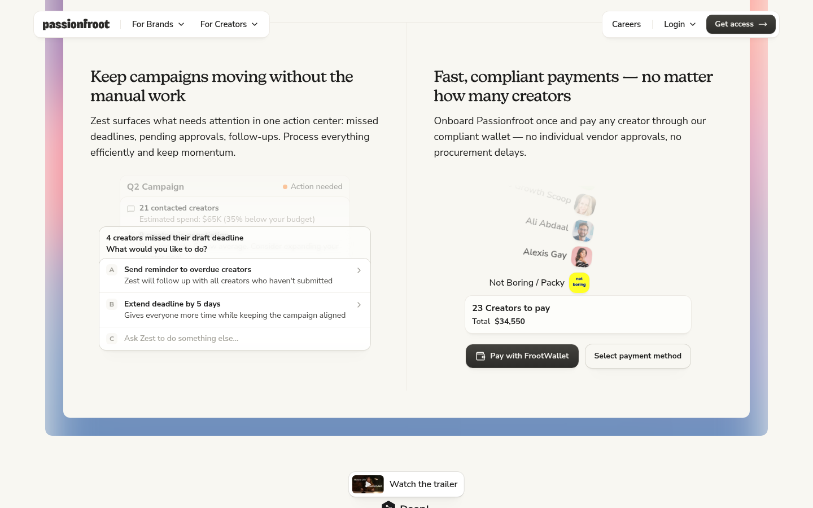

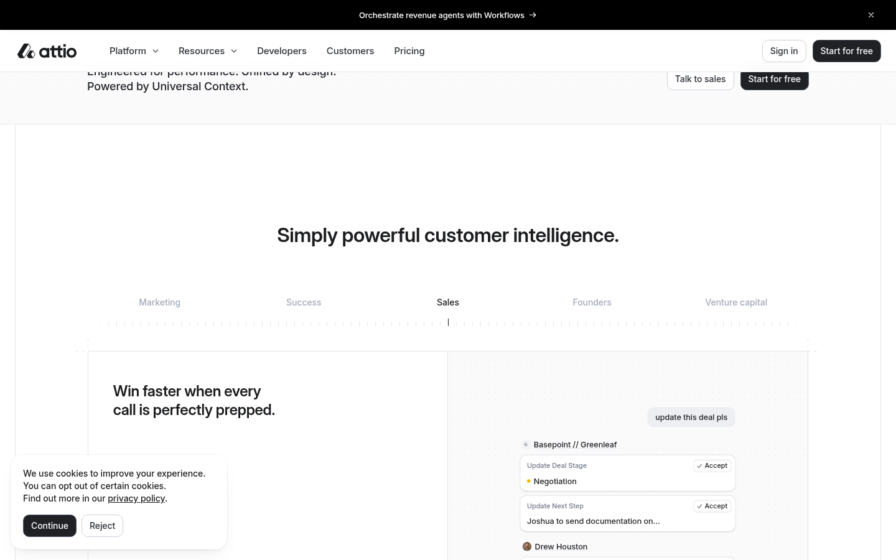

**Lo que no tomo**
- El CTA negro en forma de píldora de Passionfroot: el radio de botón es 6 para que encaje con tablas densas.
- El modo oscuro por defecto de Linear: C4M es claro por defecto, y las firmas y los PDF se leen sobre papel.
- El azul de envío de Attio: el envío del composer usa `--primary`.

---

## 7. Prompt para el agente de código (rama `ux/prototipo`)

> Copiar tal cual. El agente necesita leer este documento y las maquetas. Si trabaja fuera de esta máquina, primero hay que copiar `design-spec-c4m.md`, `mockups/` (`tokens.css`, `base.css`, `*.html`, `*.png`, `fonts/`), `refs/` y `tools/tokens.mjs` a `docs/design/` del repo.

````text
Eres el agente de código del prototipo de C4M APP (Next.js 16.3, React 19.2, Tailwind 4, shadcn sobre @base-ui/react, Prisma, lucide-react ^1.47, sonner, next-themes). Repo: github.com/Frekit/C4M.

OBJETIVO
Montar un PROTOTIPO FUNCIONAL del rediseño que describe docs/design/design-spec-c4m.md (Fase 2 de la auditoría + UI del panel IA de la Fase 3), con datos reales en modo local (AUTH_MODE=local, SQLite). La spec manda; las maquetas (docs/design/mockups/*.html y *.png) son la referencia visual. Si chocan, gana la spec. Escribe toda la UI en español de España.

RAMA
1. git fetch origin
2. Si existe origin/ux/fase-0-1: git checkout -b ux/prototipo origin/ux/fase-0-1
   Si NO existe (a 5 oct 2026 aún no estaba publicada): PARA y avisa. No partas de main sin confirmación, porque la spec da por hechos los tokens, StatusPill, Field, layout público y arreglos de axe de la Fase 0+1.
3. Un commit por bloque (ver PLAN), con mensajes en español: "feat(ui): …".

NO HAGAS
- No ejecutes `prisma migrate reset` ni `npm run db:reset`. Usa `prisma migrate deploy` y `npm run db:seed`.
- No toques Vercel (ni proyectos, ni variables, ni despliegues). No hagas push --force.
- No añadas dependencias fuera de: cmdk (vía `npx shadcn@latest add command`), los componentes shadcn sidebar/sheet/command/popover/tooltip/toggle-group, @tanstack/react-table, AI Elements (`npx shadcn@latest add https://elements.ai-sdk.dev/api/registry/all.json`), `ai` y `@ai-sdk/react`.
- No cambies el modelo de datos salvo lo marcado [nuevo] en la spec, y solo si es imprescindible para el prototipo. Si hace falta, migración aditiva.
- No inventes estados: usa el mapa de §3.4 (salido de prisma/schema.prisma).

PLAN (en este orden)
1. Tokens y base (§2)
   - Lleva los valores OKLCH de docs/design/mockups/tokens.css a src/app/globals.css (:root y .dark), respetando los nombres que dejó P1.1. Mapea: background=bg, card/popover=surface, muted=surface-2, accent=surface-3, foreground=fg, muted-foreground=fg-muted, border, input=border-strong, ring=focus, primary/primary-foreground, destructive=danger. Añade success/warning/info/danger (+ -muted, -dot), brand, brand-ui, brand-muted, ai y ai-muted en @theme inline.
   - Vuelve a pasar `node docs/design/tokens.mjs check` (o el script de P1.1) y deja 0 fallos.
   - Añade Newsreader con next/font/google (400 y 500, latin + latin-ext, display swap). Crea utilidades Tailwind v4 (@utility) para cada token tipográfico de §2.2: text-display-30, text-heading-24/20/16/14, text-label-14/13/12, text-copy-14/13/12, text-eyebrow-11.
   - Define las variables de movimiento --dur-* y --ease-* de §2.8 y el bloque prefers-reduced-motion.
   - Activa el modo oscuro con next-themes (class="dark") y un toggle en el menú de usuario.
2. components/brand-icon.tsx: Instagram, TikTok y YouTube en SVG de trazo 24×24, strokeWidth 1.75 (lucide 1.x no los trae).
3. AppShell (§3.6, §4.0, P2.1)
   - Sidebar shadcn de 240 px con grupos Operación / Dinero / Admin (plegado, solo Admin) filtrados por can(). Arriba Centro de acciones (contador de urgentes) y Asistente; abajo usuario.
   - Rail de 64 px entre 761 y 1180 px. En móvil, barra inferior de 64 px (Acciones · Campañas · Contenidos · Asistente · Más→Sheet).
   - Topbar sticky de 52 px con migas y un hueco para el estado de autosave.
   - Paleta ⌘K (§3.7): busca en /api/creators/search, contratos, campañas y contenidos, más las acciones. Última opción: «Preguntar al asistente».
   - Hook propio useHotkeys que ignore inputs y textarea. Atajos de §5.3 y diálogo `?`.
4. PageShell (narrow 720 / default 1120 / wide 1240 / full) y PageHeader (§3.8). Migra todas las page.tsx y elimina los max-w sueltos.
5. Centro de acciones en app/page.tsx (§4.1). Tarjetas a partir de: ops-alerts.ts (expired_signature, unsigned_published), SignatureRequest VIEWED con expiresAt, Deliverable con scheduledFor vencido sin publicar, publicados sin postUrl, lote listo (SUBMITTED + paymentDueAt ≤ hoy + sin paidAt), platformSubmitError y mensajes CLIENT.
   - La tarjeta más urgente lleva opciones A/B/C. Las opciones que escriben datos piden confirmación en línea.
   - «E» resuelve; en el prototipo, guarda los resueltos en localStorage.
   - KPI en 4 segmentos y lateral con Esta semana y Actividad (AuditEvent).
6. Campaña = Planilla por defecto (§4.2, P2.5). Columnas y totales de §4.2 con los campos de CampaignTalent/Creator, y edición en línea con autosave (§5.5) de coste, venta y estado.
   - Selección + barra de acciones en lote.
   - «Generar contrato» en filas APPROVED.
   - «Añadir perfil» = alta unificada en Sheet con campaignId prefijado.
7. Contrato (§4.3, P2.3)
   - Cabecera con código mono + StatusPill, stepper Borrador → Enviado → Firmado → Completado y pestañas Resumen · Contenidos · Firma y pago · Historial.
   - Lateral «Antes de enviar», que bloquea el primario con tooltip.
   - Barra CTA sticky con UN primario según estado (tabla de §4.3). «Enviar para firma» abre un diálogo con expiresInDays.
   - Navegación J/K entre contratos de la campaña.
   - Objetivo: < 1.400 px de alto con CTR-2026-001 (34 contenidos, pagina de 20 en 20).
8. Contenidos (§4.4, P2.4): components/data-table.tsx con TanStack. Debe tener:
   - Cabecera sticky.
   - Roving tabindex con J/K/Intro/X y selección por rango.
   - Barra flotante de acciones en lote.
   - Vistas guardadas (filtros en cliente).
   - Tarjetas por debajo de 760 px.
   - Sheet de detalle con autosave y validación de postUrl duplicado (postUrlKey único), con el texto exacto de §5.1.
   Reutiliza la DataTable en /creators/catalogo.
9. Firma externa (§4.5) dentro del layout (public) de P1.5:
   - 3 pasos (Revisa · Tus datos de cobro · Firma) con los campos que ya tiene sign-form.tsx, agrupados.
   - Tarjeta sticky con el importe; en móvil, barra sticky inferior.
   - Estado firmado arriba, con «Descargar PDF firmado».
   - No cambies la lógica de firma ni la huella.
10. Panel IA ⌘J (§3.13–3.15, §4.6): SOLO UI en este prototipo.
   - Panel no modal que empuja el layout: 440 px, 380 px a ≤ 1180, pantalla completa en móvil.
   - Usa AI Elements re-estilado con los tokens. Contexto de ruta como chip, composer, chips de sugerencia y línea de herramienta.
   - ApprovalCard con props que imiten las partes de tool de AI SDK (state 'approval-requested' | 'output-available', approval.id, approval.isAutomatic, approval.requestReason, input).
   - Con NEXT_PUBLIC_AI_PANEL=demo, el panel carga la conversación de ejemplo de §4.6. Aceptar o descartar cambia el estado local y, al terminar, la fila de la Planilla destella --ai-muted. No se escribe en la base de datos.
   - Página /dev/ia con todos los estados de §3.13 (pendiente, aceptado, aplicando, hecho, descartado, aviso, error).
   - La conexión real con ToolLoopAgent (P3.1) queda fuera de esta rama.
11. Copy y microinteracciones: aplica TODOS los textos de §5.1, §5.2 y §5.5 (vacíos, carga, errores, toasts y autosave), los órdenes de foco de §5.4 y los formatos es-ES / Europe/Madrid de §5.6.

QA (obligatorio antes de dar por terminado)
- npm run verify en verde. next build sin errores.
- axe: 0 violaciones en las 29 rutas de la auditoría, a 1440 y a 375. Contraste: ningún par nuevo por debajo de 4,5 (texto) ni de 3,0 (UI).
- Teclado: recorre §5.4 en Centro de acciones, Planilla, Contrato, Contenidos, Firma y Panel IA, sin trampas de foco.
- prefers-reduced-motion: comprueba con la emulación de DevTools que no hay desplazamientos.
- Capturas con Playwright o puppeteer a 1440, 1024 y 375 de: /, /campanas/<Navidad 2026>, /contratos/<CTR-2026-001>, /contenidos, /firmar/<token>, y el panel ⌘J en demo. Guárdalas en docs/design/prototipo/ y compáralas con docs/design/mockups/*.png.
- Lighthouse móvil de / y /contenidos: anota LCP, INP y CLS (objetivo LCP < 2,5 s).

ENTREGA
Abre un PR borrador ux/prototipo → ux/fase-0-1 con:
- Resumen por bloque (1–11), con lo hecho y lo que falta.
- Tabla de capturas antes/después.
- Resultados de axe y Lighthouse.
- Lista de todo lo marcado [nuevo] que hayas implementado o simulado.
No hagas merge.
````

---

## Anexo · Cómo regenerar las maquetas
- **Tokens y contraste:** `cd /workspace/c4m-audit/tools && node tokens.mjs check v` regenera `mockups/tokens.css`, `tokens-contrast.json` y `tokens-hex.json`.
- **Planilla y panel IA:** `cd ../mockups && python3 build.py` (usa `gen_planilla.py`, `_planilla-*.html/css` y `_ia-*.html/css`).
- **Contenidos:** `python3 gen_contenidos.py`.
- **Capturas:** `cd ../tools && bash shoot-all.sh` (puppeteer-core + `/usr/bin/google-chrome`; Playwright no está instalado en esta máquina).

Las maquetas cargan `lucide.min.js` (lucide 1.52.0, local) y las fuentes de `mockups/fonts/`, así que no necesitan red.
